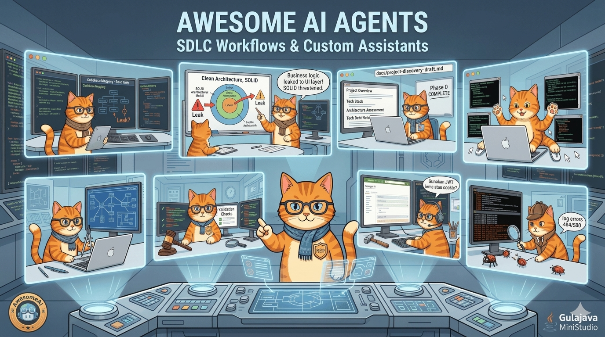
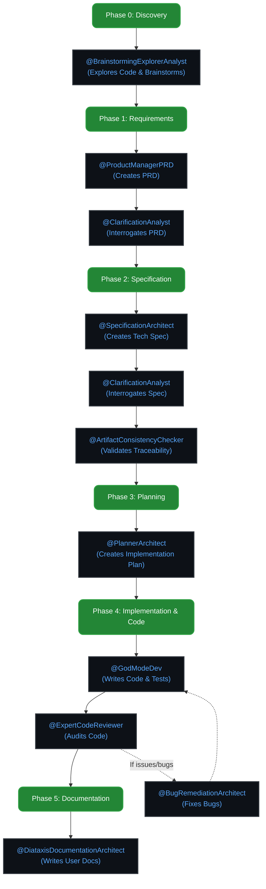

# Awesome Copilot Indonesia 🇮🇩
<!-- markdownlint-disable -->

A curated collection of custom agents, skills, rules, and prompts. Originally for **GitHub Copilot**, this collection now fully supports **OpenCode**, **Google Antigravity**, **CommandCode**, **ChatGPT Codex**, **Pi Dev Coding Agent**, and **Oh My Pi (`omp`)**, specifically tailored for Indonesian developers and development workflows. The custom agents and SDLC workflows are heavily inspired by the [GitHub Spec Kit](https://github.com/github/spec-kit), with additional enhancements and refinements.

[](https://github.com/features/copilot)
[](CONTRIBUTING.md)

<p align="center">
  
</p>

## 📋 Overview

This repository provides a comprehensive set of tools to enhance your AI-assisted development experience, including:

- **🤖 Custom Agents**: Specialized AI agents for different development scenarios (PRD, Specification, Planning, Coding, Review).
- **🤹 Skills**: Specialized capabilities paired with agents for advanced autonomous workflows.
- **📝 Rules & Instructions**: Best practices and coding guidelines for various languages and frameworks.
- **🔑 BYOK Copilot Config**: Ready-to-use `chatLanguageModels.json` template for bringing your own API keys to VS Code Copilot chat.
- **🔌 Multi-Platform**: Ready-to-use configurations for OpenCode (`.opencode`), Google Antigravity (`.agents`), GitHub Copilot (`.github`), CommandCode (`.commandcode`), ChatGPT Codex (`.codex`), Pi Dev Coding Agent (`.pi`), and Oh My Pi (`.omp`).

## 🚀 Getting Started

### Prerequisites

- An AI Assistant platform of your choice:
  - **CommandCode**
  - **OpenCode**
  - **Google Antigravity**
  - **GitHub Copilot** (Individual, Business, or Enterprise)
  - **ChatGPT Codex**
  - **Pi Dev Coding Agent** ([pi.dev](https://pi.dev/))
  - **Oh My Pi (`omp`)** ([omp.sh](https://omp.sh/))

### Installation

1. Clone this repository:

   ```bash
   git clone https://github.com/yourusername/awesome-copilot-id.git
   ```

2. **Choose your platform configuration**:
   - For **CommandCode**: Copy the `.commandcode` directory to your project root.
   - For **OpenCode**: Copy the `.opencode` directory from `opencode-configuration/` to your project root.
   - For **Google Antigravity**: Copy the `.agents` directory to your project root.
   - For **GitHub Copilot**: Copy the `.github` directory to your project root.
   - For **ChatGPT Codex**: Copy the `.codex` directory to your project root.
   - For **Pi Dev Coding Agent**: Copy the `.pi` directory to your project root.
   - For **Oh My Pi (`omp`)**: Copy the `.omp` directory to your project root.

   > [!IMPORTANT]
   > **Don't copy everything!** Only select the agents, skills, or rules that match your development needs.

3. **Mandatory Step**: Copy the `AGENTS.md` file to the root of your project. This file contains the core SDLC rules, directives, and interaction philosophy that all agents must follow to ensure consistency.

   ```bash
   cp awesome-copilot-id/AGENTS.md ./
   ```

   > [!IMPORTANT]
   > After copying `AGENTS.md`, you **must** open it and update the first line (`# AGENTS.md - [Your Application Name]`) to match your actual project's context. This helps the AI agents understand the specific project they are working on.

4. Example manual installation for specific agents and skills:

   ```bash
   # Create directories based on your platform (e.g., Google Antigravity)
   mkdir -p .agents/rules .agents/skills

   # Copy specific agents
   cp awesome-copilot-id/.agents/rules/GodModeDev.md .agents/rules/
   
   # Copy specific skills
   cp -r awesome-copilot-id/.agents/skills/karpathy-guidelines .agents/skills/
   ```

5. Restart your IDE or AI assistant to apply the changes.

> [!TIP]
> You can also reference these files from a central location in your system and symlink them to your projects for easier management.

## 🤖 Custom Agents

Custom agents are specialized AI assistants for specific development roles and tasks. Each agent is paired with a specific skill to accomplish its phase in the development lifecycle. Place them in your platform's respective directory (`.commandcode/agents/`, `.agents/rules/`, `.opencode/agents/`, `.github/agents/`, `.codex/agents/`, `.pi/agents/`, or `.omp/agents/`).

> [!IMPORTANT]
> **Don't forget to copy `AGENTS.md`** to your project root after copying these agents. This file contains the core SDLC rules that all agents must follow. See [Step #3 in Installation](#installation) for details.

| Agent                               | Associated Skill                                                          | Description                                          | Best For                                                            |
| ----------------------------------- | ------------------------------------------------------------------------- | ---------------------------------------------------- | ------------------------------------------------------------------- |
| **@BrainstormingExplorerAnalyst**   | `brainstorming-explorer`                                                  | Codebase exploration and architectural brainstorming | Phase 0 Discovery, exploring unfamiliar code, generating raw drafts |
| **@ProductManagerPRD**              | `product-manager-prd`                                                     | Product Requirement Document creation                | Feature planning, writing user stories, and acceptance criteria     |
| **@ClarificationAnalyst**           | `clarification-analyst`                                                   | Requirement interrogation                            | Finding ambiguities and missing edge cases in PRD/Specs/Plans       |
| **@SpecificationArchitect**         | `specification-architect`                                                 | Technical specification creation                     | Writing detailed, machine-readable tech specs                       |
| **@ArtifactConsistencyChecker**     | `artifact-consistency-checker`                                            | Consistency & traceability audit                     | Validating PRD vs Spec vs Plan to prevent scope creep               |
| **@PlannerArchitect**               | `planner-architect`                                                       | Strategic planning & architecture                    | Generating formal, structured implementation plans                  |
| **@GodModeDev**                     | `karpathy-guidelines` (supp: `omni-dev`, `ui-designer`, `fable-protocol`) | God-Tier Autonomous Engineer                         | Coding, implementation, and surgical modifications                  |
| **@ExpertCodeReviewer**             | `expert-code-reviewer`                                                    | Code review and security audit                       | Clean Code/SOLID audits and refactoring plans                       |
| **@BugRemediationArchitect**        | `bug-remediation-architect`                                               | Bug analysis and fixing                              | Root cause analysis and structured bug-fix plans                    |
| **@DiataxisDocumentationArchitect** | `diataxis-documentation-architect`                                        | Technical documentation specialist                   | Writing tutorials, how-to guides, and reference docs                |

### How to Use Custom Agents

Depending on your platform (CommandCode, OpenCode, Antigravity, Copilot, ChatGPT Codex, Pi Dev, or Oh My Pi `omp`), you can usually invoke these agents via chat:

```text
@GodModeDev implement the shopping cart based on the plan
@ExpertCodeReviewer review my service layer and suggest refactoring
@ProductManagerPRD create a PRD for the user authentication module
```

## 🤹 Skills

Skills provide agents with specialized capabilities, workflows, and prompts. They are located in the `skills` directory (e.g., `.commandcode/skills`, `.agents/skills`, `.opencode/skills`, `.codex/skills`, `.pi/skills`, or `.omp/skills`).

> [!IMPORTANT]
> **Don't forget to copy `AGENTS.md`** to your project root after copying these skills. This file contains the core SDLC rules that all agents and skills must follow. See [Step #3 in Installation](#installation) for details.

| Skill                                | Description                                                                                                                                                                                        |
| ------------------------------------ | -------------------------------------------------------------------------------------------------------------------------------------------------------------------------------------------------- |
| **brainstorming-explorer**           | Systematic codebase exploration, architectural critique, and Project Discovery Draft generation                                                                                                    |
| **memory-manager**                   | Standardized workflow for discovering, reading, writing, and compacting `memory.instructions.md` with a permanent Knowledge Base for cross-session decisions and fast-path discovery via AGENTS.md |
| **karpathy-guidelines**              | Behavioral guidelines to reduce common LLM coding mistakes and encourage surgical modifications                                                                                                    |
| **omni-dev**                         | Omni-expert principal software architect. Enforces clean code, clean architecture, deep reasoning, mandatory testing, and strict anti-ambiguity protocols                                          |
| **product-manager-prd**              | Workflow to generate comprehensive PRDs                                                                                                                                                            |
| **clarification-analyst**            | Interrogates requirements for hidden assumptions and edge cases                                                                                                                                    |
| **specification-architect**          | Generates detailed technical specs based on clarified requirements                                                                                                                                 |
| **ui-designer**                      | Elite UI/UX Design Lead & Frontend Architect. Generates distinctive, non-templated interfaces with opinionated aesthetics, deliberate typography, and exact UX copy                                |
| **artifact-consistency-checker**     | Validates traceability across documents to prevent missing coverage                                                                                                                                |
| **planner-architect**                | Generates formal executable implementation plans                                                                                                                                                   |
| **expert-code-reviewer**             | Code review and security audit against Clean Code principles                                                                                                                                       |
| **bug-remediation-architect**        | Workflow for tracing root causes and generating bug-fix strategies                                                                                                                                 |
| **diataxis-documentation-architect** | Audits and writes structured documentation based on Diátaxis Framework                                                                                                                             |
| **fable-protocol**                   | An advanced, autonomous AI agent skill designed to execute complex, multi-step, and long-horizon tasks with high reliability and minimal human interruption                                        |

### Agent and Skill Configuration File Structure

Agent files use the `.md` or `.agent.md` extension depending on the platform, and feature a YAML frontmatter:

```yaml
---
description: "God Mode Developer - God-Tier Autonomous Engineer with Deep Thinking Protocol."
mode: all
---
```

**Body**: Instructions and guidelines for the agent behavior. You can:

- Define specialized instructions for the agent's role
- Specify core directives and interaction philosophies
- Detail how the agent should utilize its assigned skill

## 🔄 Workflow & Methodology (Spec Kit Inspired)

We adopt a strict and structured SDLC workflow, heavily inspired by the GitHub Spec Kit approach. Development must follow a sequential order, with no skipped phases:

0. **Discovery (Phase 0)**: Use `@BrainstormingExplorerAnalyst` to explore existing codebases, brainstorm architecture, and generate raw drafts for Product Managers.
1. **PRD (Requirements)**: Use `@ProductManagerPRD` to define user stories and acceptance criteria.
2. **Clarification**: Use `@ClarificationAnalyst` to interrogate the PRD, Technical Specification, or Implementation Plan to resolve ambiguities.
3. **Spec (Technical Specification)**: Use `@SpecificationArchitect` to generate machine-readable technical specs.
4. **Consistency Check**: Use `@ArtifactConsistencyChecker` to validate traceability across PRD, Spec, and Plan.
5. **Plan (Implementation Planning)**: Use `@PlannerArchitect` to generate executable implementation plans.
6. **Code (Implementation)**: Use `@GodModeDev` for coding, ensuring strict testing (unit/widget/integration) after every phase.
7. **Review**: Use `@ExpertCodeReviewer` for code review and security audits. *(For bug fixes, use `@BugRemediationArchitect`)*
8. **Docs**: Use `@DiataxisDocumentationArchitect` for user documentation.

> [!IMPORTANT]
> - Complete and structured documentation must exist before coding begins.
> - Every output must be verified against the PRD and Spec before proceeding.
> - We recommend starting a new chat session when switching phases to maintain context focus.

### 🎯 Use Cases

#### End-to-End Feature Development (SDLC Workflow)

Following our strict sequential workflow, here is how you would develop a new feature:

**Phase 1: Requirements & Clarification**
```text
@ProductManagerPRD create a PRD for the shopping cart feature
@ClarificationAnalyst interrogate the new shopping cart PRD for missing edge cases
```

**Phase 2: Specification & Planning**
```text
@SpecificationArchitect design a technical specification for the shopping cart based on the PRD
@ClarificationAnalyst interrogate the technical specification for any technical ambiguities
@PlannerArchitect create a step-by-step implementation plan for the shopping cart
@ArtifactConsistencyChecker verify that the plan and spec cover all requirements in the PRD
```

**Phase 3: Implementation & Review**
```text
@GodModeDev implement the shopping cart based on the plan, and ensure all tests pass
@ExpertCodeReviewer review the newly implemented service layer and suggest refactoring
```

**Phase 4: Documentation & Bug Fixing**
```text
@DiataxisDocumentationArchitect write an API reference guide for the new endpoints
@BugRemediationArchitect analyze the bug report for the checkout failure and propose a fix
```

### 🌟 Best Practices

1. **Adhere to the SDLC Sequence**: Never skip a phase. Ensure that PRD, Specs, and Plans are fully fleshed out before invoking `@GodModeDev` for coding.
2. **Platform-Specific Directories**: Place your rules, skills, and agents in the correct directories for your platform (`.commandcode`, `.opencode`, `.agents`, `.github`, `.codex`, `.pi`, or `.omp`).
3. **Use Appropriate Agents**: Match the agent to the current SDLC phase (e.g., `@SpecificationArchitect` for specs, `@ExpertCodeReviewer` for code audits).
4. **Leverage Project Memory**: Periodically save significant milestones using the `memory-manager` skill to maintain context across different chat sessions.
5. **Iterate and Verify**: Always verify the outputs of an agent against the original PRD and Spec before proceeding to the next phase.

### 📊 SDLC Workflow Diagram



## 📝 Instructions

Instructions are rules and guidelines that your AI Assistant follows when generating code. Place them in your platform's respective directory (`.commandcode/instructions/`, `.github/instructions/`, `.opencode/instructions/`, `.agents/rules/`, `.pi/instructions/`, or `.omp/instructions/`).

> [!IMPORTANT]
> **Don't forget to copy `AGENTS.md`** to your project root after copying these instructions. This file contains the core SDLC rules that bind all instructions. See [Step #3 in Installation](#installation) for details.

| Instruction                              | Description                                           | Apply To                |
| ---------------------------------------- | ----------------------------------------------------- | ----------------------- |
| **taming-copilot**                       | Core directives for precise, surgical code assistance | All files (`**`)        |
| **clean-code-clean-architecture**        | Clean code principles and architecture patterns       | All files (`**`)        |
| **strict-clean-code-clean-architecture** | Strict enforcement of clean code/architecture         | All files (`**`)        |
| **nodejs-codestyle**                     | Node.js best practices and conventions                | `**/*.js`, `**/*.ts`    |
| **eloquent-js-codestyle**                | Eloquent JavaScript style guide                       | `**/*.js`               |
| **php-laravel-codestyle**                | Laravel framework conventions                         | `**/*.php`              |
| **flutter-codestyle**                    | Flutter and Dart best practices                       | `**/*.dart`             |
| **html-css-responsive**                  | Responsive HTML/CSS design principles                 | `**/*.html`, `**/*.css` |
| **markdown**                             | Markdown formatting standards                         | `**/*.md`               |
| **memory**                               | Project-specific context and preferences              | All files (`**`)        |

### Instruction Format

```markdown
---
applyTo: "**/*.js"
description: "Node.js coding standards"
---

# Your instruction content here
```

## 💡 Prompts

Prompt files are reusable templates for common development tasks like generating code, performing code reviews, or scaffolding project components. They are standalone prompts you can run directly in chat. Place them in your platform's respective directory (`.commandcode/prompts/`, `.github/prompts/`, `.opencode/prompts/`, or `.agents/prompts/`).

| Prompt                         | Description                         |
| ------------------------------ | ----------------------------------- |
| **create-readme**              | Generate comprehensive README files |
| **create-specification**       | Create technical specifications     |
| **update-specification**       | Update existing specifications      |
| **create-implementation-plan** | Generate implementation plans       |
| **update-implementation-plan** | Update implementation plans         |
| **breakdown-feature-prd**      | Break down features from PRD        |
| **documentation-writer**       | Write technical documentation       |
| **review-and-refactor**        | Code review and refactoring         |
| **boost-prompt**               | Enhance and improve prompts         |
| **fixing-prompt**              | Debug and fix issues                |
| **remember**                   | Store project context               |
| **project-memory-keeper**      | Maintain project memory             |

### How to Use Prompt Files

You have multiple options to run a prompt file:

1. **In Chat View**: Type `/` followed by the prompt name in the chat input field

   ```text
   /create-specification for user authentication module
   /create-readme
   ```

2. **From Command Palette**: Run `Chat: Run Prompt` command (Ctrl+Shift+P) and select a prompt file

3. **From Editor**: Open the prompt file and press the play button in the editor title area

> [!TIP]
> You can add extra information in the chat input field. For example: `/create-react-form formName=MyForm` or `/breakdown-feature-prd for shopping cart`

### Prompt File Structure

Prompt files use the `.prompt.md` extension and can include:

**Header (YAML frontmatter)**:

```yaml
---
description: "A short description of the prompt"
name: "prompt-name"  # Optional, defaults to filename
argument-hint: "Optional hint text for users"
agent: "agent"  # ask, edit, agent, or custom agent name
model: "gpt-4"  # Optional language model
tools: ["edit", "search", "runCommands"]  # Available tools
---
```

**Body**: The prompt text with instructions. You can use:

- **Variables**: `${workspaceFolder}`, `${selection}`, `${file}`, `${input:variableName}`
- **Markdown links**: Reference other workspace files using relative paths
- **Tool references**: Use `#tool:toolName` syntax (e.g., `#tool:githubRepo`)

## 🔑 BYOK Copilot Config

A ready-to-use configuration template for enabling **BYOK (Bring Your Own Key)** on GitHub Copilot in Visual Studio Code. Use your own API keys from various providers (OpenRouter, DeepSeek, Opencode Zen, Opencode Go, Kilo Gateway, and others) to extend the list of available chat models.

> [!NOTE]
> BYOK models work without a GitHub account or Copilot plan and are used for chat and utility tasks only. Some features (semantic search, inline suggestions, embeddings) still require GitHub Copilot.

See the full documentation and setup guide: [byok-copilot-config/](byok-copilot-config/)

## 🛠️ Customization

You can implement customizations incrementally, starting with the simplest options and gradually adding more complexity as needed.

### 1. Set Up Basic Guidelines (Custom Instructions)

Create custom instructions for consistent results across all your chat interactions. Custom instructions let you define common guidelines or rules for tasks like generating code, performing code reviews, or generating commit messages.

**File location**: `.commandcode/instructions/`, `.github/instructions/`, `.opencode/instructions/`, or `.agents/rules/`

**Format**:

```markdown
---
applyTo: "**/*.ts"
description: "TypeScript coding standards"
---

# Your instruction content here

- Use strict type checking
- Follow functional programming principles
- Always handle errors explicitly
```

**Use custom instructions to**:

- Specify coding practices, preferred technologies, or project requirements
- Provide guidelines about commit messages or PR descriptions
- Set rules for code reviews (security, performance, coding standards)

#### Quick Start: Generate Instructions from Programming Books

You can use AI assistants to help create custom instructions based on programming books or documentation:

1. **Upload a programming book PDF** (e.g., "Eloquent JavaScript", "Clean Code", "Design Patterns") to:
   - Gemini AI (supports PDF upload)
   - Claude AI (supports PDF upload)
   - ChatGPT (supports PDF upload with Plus/Pro subscription)

2. **Use this prompt**:

   ```text
   Study this programming book PDF carefully and create a GitHub Copilot custom instruction file based on the principles, patterns, and best practices from the book. 
   
   The instruction should:
   - Follow the .instructions.md format with YAML frontmatter
   - Include key principles from the book
   - Provide specific coding guidelines
   - Be practical and actionable for daily development
   ```

3. **Review and customize** the generated instruction file to match your team's needs

4. **Save** the file to your platform's instructions directory (e.g., `.github/instructions/`) with a descriptive name (e.g., `eloquent-js-codestyle.instructions.md`)

> [!TIP]
> This method is especially useful for creating language-specific or framework-specific instructions based on authoritative sources.

### 2. Add Task Automation (Prompt Files)

Prompt files let you define reusable prompts for common and repeatable development tasks. They're standalone prompts you can run directly in chat.

**File location**: `.commandcode/prompts/`, `.github/prompts/`, `.opencode/prompts/`, or `.agents/prompts/`

**Format**:

```markdown
---
agent: "agent"
description: "Create technical specifications"
---

## Role
You are a technical architect...

## Task
1. Analyze the feature requirements
2. Create a detailed technical specification
```

**Use prompt files to**:

- Create reusable prompts for common coding tasks (scaffolding components, generating tests)
- Define prompts for code reviews
- Create step-by-step guides for complex processes
- Generate implementation plans or architectural designs

### 3. Create Specialized Workflows (Custom Agents)

Custom agents are specialist assistants for specific roles or tasks. Within a custom agent file, you describe its scope, capabilities, which tools it can access, and preferred language model.

**File location**: `.commandcode/agents/`, `.github/agents/`, `.opencode/agents/`, or `.agents/rules/`

**Format**:

```markdown
---
description: "Frontend Developer Specialist"
tools: ["edit", "search", "runCommands"]
---

# Frontend Developer Agent

You are a frontend development specialist focusing on React and TypeScript...
```

**Use custom agents to**:

- Create a planning agent with read-only access for implementation plans
- Define a research agent that can reach external resources
- Create specialized agents for specific domains (frontend, backend, database, etc.)

### 4. Extend Capabilities (MCP and Tools)

Connect external services and specialized tools through Model Context Protocol (MCP) to extend chat capabilities beyond code.

**Use MCP and tools to**:

- Connect database tools to query and analyze data
- Integrate with external APIs for real-time information

### 5. Choose the Right Model (Language Models)

Switch between different AI models optimized for specific tasks using the model picker in chat.

**Use different models for**:

- Fast models for quick code suggestions and simple refactoring
- Capable models for complex architectural decisions or detailed reviews
- Specialized models for vision processing or other specific tasks

## 🤝 Contributing

Contributions are welcome! Whether it's:

- Adding new agents for specific development scenarios
- Improving existing instructions
- Creating new prompt templates
- Fixing bugs or improving documentation

Please feel free to submit a Pull Request.

## 📚 Resources

- [GitHub Copilot Customization Overview](https://code.visualstudio.com/docs/copilot/customization/overview) - Official VS Code documentation for customizing GitHub Copilot
- [GitHub Copilot Documentation](https://docs.github.com/en/copilot)
- [VS Code GitHub Copilot Extension](https://marketplace.visualstudio.com/items?itemName=GitHub.copilot)
- [Awesome Copilot](https://github.com/github/awesome-copilot) - A curated list of GitHub Copilot resources, extensions, and examples
- [VS Code BYOK Documentation](https://code.visualstudio.com/docs/agent-customization/language-models) - Official guide for bringing your own language model keys
- [BYOK Config Template](byok-copilot-config/) - Pre-built `chatLanguageModels.json` template included in this repository

## ⭐ Support

If you find this repository helpful, please consider giving it a star! It helps others discover these resources.

## 📄 License

This project is open source and available under the [MIT License](LICENSE).

---

## **Made with ❤️ for Indonesian Developers**

