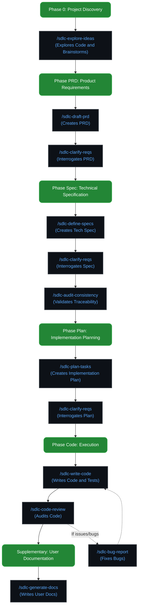

# Awesome Copilot Indonesia 🇮🇩 - AI Agents & SDLC Workflows
<!-- markdownlint-disable -->

A curated collection of custom agents, skills, rules, and prompts for AI-assisted development, specifically tailored for Indonesian developers and development workflows. This collection uses a **Single Source of Truth** architecture: all agent configurations live in the `.agents/` directory and are automatically mapped to platform-specific folders during installation. Supported platforms include **GitHub Copilot**, **Google Antigravity**, **OpenCode**, **CommandCode**, **ChatGPT Codex**, **Pi Dev Coding Agent**, **Oh My Pi (`omp`)**, **Claude Code**, and **Cursor**. The SDLC workflows are heavily inspired by the [GitHub Spec Kit](https://github.com/github/spec-kit), with additional enhancements and refinements.

[](https://github.com/features/copilot)
[](#-contributing)

<p align="center">
  
</p>

## 📋 Overview

This repository provides a comprehensive set of tools to enhance your AI-assisted development experience, including:

- **🤖 Custom Agents**: Specialized AI agents for different development scenarios (PRD, Specification, Planning, Coding, Review).
- **🤹 Skills**: Specialized capabilities paired with agents for advanced autonomous workflows.
- **📝 Rules & Instructions**: Best practices and coding guidelines for various languages and frameworks.
- **🔑 BYOK Copilot Config**: Ready-to-use `chatLanguageModels.json` template for bringing your own API keys to VS Code Copilot chat.
- **🔌 Multi-Platform**: A single `.agents/` configuration that is automatically installed to the correct platform directory. Standard platforms (GitHub Copilot, Antigravity, OpenCode, CommandCode, Codex, Pi, OMP) use `.agents/`, Claude Code uses `.claude/`, and Cursor uses `.cursor/`.

## 📑 Table of Contents

- [Overview](#-overview)
- [Getting Started](#-getting-started)
  - [Prerequisites](#prerequisites)
  - [Installation](#installation)
- [Custom Agents](#-custom-agents-via-sdlc-slash-commands)
- [Skills](#-skills)
- [Workflow & Methodology](#-workflow--methodology-spec-kit-inspired)
- [Supplementary Skills](#-supplementary-skills)
- [BYOK Copilot Config](#-byok-copilot-config)
- [Advanced Customization Guide](#️-advanced-customization-guide)
- [Contributing](#-contributing)
- [Resources](#-resources)
- [Support](#-support)
- [License](#-license)

## 🚀 Getting Started

### Prerequisites

- An AI Assistant platform of your choice:
  - **GitHub Copilot** (Individual, Business, or Enterprise)
  - **Google Antigravity**
  - **OpenCode**
  - **CommandCode**
  - **ChatGPT Codex**
  - **Pi Dev Coding Agent** ([pi.dev](https://pi.dev/))
  - **Oh My Pi (`omp`)** ([omp.sh](https://omp.sh/))
  - **Claude Code**
  - **Cursor**

### Installation

Choose either the **Automated (recommended)** or **Manual** installation method:

#### Method 1: Automated Installation (One-Liner)

Run the following command in your terminal inside your project root directory:

*   **Linux / macOS (Bash/Zsh):**
    ```bash
    curl -fsSL https://raw.githubusercontent.com/GulajavaMinistudio/awesome-copilot-id/main/install.sh | bash
    ```
*   **Windows Terminal (PowerShell):**
    ```powershell
    irm https://raw.githubusercontent.com/GulajavaMinistudio/awesome-copilot-id/main/install.ps1 | iex
    ```

The interactive script will download the repository, prompt you to choose your target platform, copy the `.agents/` configuration to the correct destination directory (`.agents/`, `.claude/`, or `.cursor/`), and safely handle existing configuration files (such as `memory.instructions.md` and `AGENTS.md`) by offering options to keep, replace, or merge them.

The installer offers these options:

| Option | Platform(s)                                                                | Destination Folder |
| ------ | -------------------------------------------------------------------------- | ------------------ |
| **1**  | Standard Platforms (GitHub Copilot, Antigravity, OpenCode, CommandCode, Codex, Pi, OMP) | `.agents/`         |
| **2**  | Claude Code                                                                | `.claude/`         |
| **3**  | Cursor                                                                     | `.cursor/`         |
| **4**  | All Platforms (install to all three directories)                           | `.agents/`, `.claude/`, `.cursor/` |

---

#### Method 2: Manual Installation

1. Clone this repository:

   ```bash
   git clone https://github.com/GulajavaMinistudio/awesome-copilot-id.git
   ```

2. **Choose your target platform and copy the `.agents/` directory**:
   - For **Standard Platforms** (GitHub Copilot, Antigravity, OpenCode, CommandCode, Codex, Pi, OMP): Copy the `.agents` directory as-is to your project root.
   - For **Claude Code**: Copy the *contents* of `.agents` into a `.claude` directory at your project root.
   - For **Cursor**: Copy the *contents* of `.agents` into a `.cursor` directory at your project root.

   ```bash
   # Standard Platforms: copy .agents/ directly
   cp -r awesome-copilot-id/.agents ./

   # Claude Code: copy contents of .agents/ into .claude/
   mkdir -p .claude && cp -a awesome-copilot-id/.agents/. .claude/

   # Cursor: copy contents of .agents/ into .cursor/
   mkdir -p .cursor && cp -a awesome-copilot-id/.agents/. .cursor/
   ```

   > [!IMPORTANT]
   > The `.agents/` directory in this repository is the **Single Source of Truth**. All platform-specific directories (`.claude/`, `.cursor/`) receive an identical copy of its contents.

3. **Mandatory Step**: Copy the `AGENTS.md` file to the root of your project. This file contains the core SDLC rules, directives, and interaction philosophy that all agents must follow to ensure consistency.

   ```bash
   cp awesome-copilot-id/AGENTS.md ./
   ```

   > [!IMPORTANT]
   > After copying `AGENTS.md`, you **must** open it and update the first line (`# AGENTS.md - [Your Application Name]`) to match your actual project's context, as well as the `[Project Description]` placeholder (if present). This helps the AI agents understand the specific project they are working on. You can also adjust the language preferences in the `## Communication` section as needed.

4. Example manual installation for specific skills:

   ```bash
   # Create directories
   mkdir -p .agents/rules .agents/skills

   # Copy specific skills
   cp -r awesome-copilot-id/.agents/skills/karpathy-guidelines .agents/skills/
   cp -r awesome-copilot-id/.agents/skills/sdlc-write-code .agents/skills/
   ```

5. Restart your IDE or AI assistant to apply the changes.

> [!TIP]
> You can also reference these files from a central location in your system and symlink them to your projects for easier management.

## 🤖 Custom Agents (via SDLC Slash Commands)

Custom agents are specialized AI assistants for specific development roles and tasks. Each agent is activated via a **slash command** that triggers the corresponding skill. All configurations reside in the `.agents/skills/` directory (or the platform-equivalent: `.claude/skills/`, `.cursor/skills/`).

> [!IMPORTANT]
> **Don't forget to copy `AGENTS.md`** to your project root after copying these agents. This file contains the core SDLC rules that all agents must follow. See [Step #3 in Installation](#installation) for details.

| Slash Command               | Skill                      | Description                                          | Best For                                                            |
| --------------------------- | -------------------------- | ---------------------------------------------------- | ------------------------------------------------------------------- |
| `/sdlc-explore-ideas`       | `sdlc-explore-ideas`       | Codebase exploration and architectural brainstorming | Phase 0 Discovery, exploring unfamiliar code, generating raw drafts |
| `/sdlc-draft-prd`           | `sdlc-draft-prd`           | Product Requirement Document creation                | Feature planning, writing user stories, and acceptance criteria     |
| `/sdlc-clarify-reqs`        | `sdlc-clarify-reqs`        | Requirement interrogation                            | Finding ambiguities and missing edge cases in PRD/Specs/Plans       |
| `/sdlc-define-specs`        | `sdlc-define-specs`        | Technical specification creation                     | Writing detailed, machine-readable tech specs                       |
| `/sdlc-audit-consistency`   | `sdlc-audit-consistency`   | Consistency & traceability audit                     | Validating PRD vs Spec vs Plan to prevent scope creep               |
| `/sdlc-plan-tasks`          | `sdlc-plan-tasks`          | Strategic planning & architecture                    | Generating formal, structured implementation plans                  |
| `/sdlc-write-code`          | `sdlc-write-code` (supp: `karpathy-guidelines`, `omni-dev`, `ui-designer`, `fable-protocol`, `ponytail-lazy-senior-dev`) | God-Tier Autonomous Engineer | Coding, implementation, and surgical modifications |
| `/sdlc-code-review`         | `sdlc-code-review`         | Code review and security audit                       | Clean Code/SOLID audits and refactoring plans                       |
| `/sdlc-bug-report`          | `sdlc-bug-report`          | Bug analysis and fixing                              | Root cause analysis and structured bug-fix plans                    |
| `/sdlc-generate-docs`       | `sdlc-generate-docs`       | Technical documentation specialist                   | Writing tutorials, how-to guides, and reference docs                |

### How to Use

Invoke the agent's underlying skill directly using the slash command syntax, and attach the required upstream documents using `@filename`:

```text
/sdlc-write-code implement the shopping cart based on @plan-shopping-cart.md
/sdlc-code-review review my service layer based on @spec-shopping-cart.md and @plan-shopping-cart.md
/sdlc-draft-prd create a PRD for the user authentication module based on @discovery-draft.md
```

## 🤹 Skills

Skills provide agents with specialized capabilities, workflows, and prompts. They are located in the `.agents/skills/` directory (or the platform-equivalent: `.claude/skills/`, `.cursor/skills/`).

> [!IMPORTANT]
> **Don't forget to copy `AGENTS.md`** to your project root after copying these skills. This file contains the core SDLC rules that all agents and skills must follow. See [Step #3 in Installation](#installation) for details.

### SDLC Phase Skills (Persona-Bound)

These skills activate a specialized agent persona and lock the session to that phase:

| Skill                      | Description                                                                                                           |
| -------------------------- | --------------------------------------------------------------------------------------------------------------------- |
| **sdlc-explore-ideas**     | Systematic codebase exploration, architectural critique, and Project Discovery Draft generation                       |
| **sdlc-draft-prd**         | Workflow to generate comprehensive PRDs with user stories and acceptance criteria                                     |
| **sdlc-clarify-reqs**      | Interrogates requirements for hidden assumptions and edge cases                                                       |
| **sdlc-define-specs**      | Generates detailed, machine-readable technical specs based on clarified requirements                                 |
| **sdlc-audit-consistency** | Validates traceability across documents to prevent missing coverage and scope creep                                   |
| **sdlc-plan-tasks**        | Generates formal, structured, and executable implementation plans                                                    |
| **sdlc-write-code**        | God-Tier Autonomous Engineer for Coding/Implementation, executing code strictly based on `/spec/` and `/plan/`       |
| **sdlc-code-review**       | Code review and security audit against Clean Code/SOLID principles                                                   |
| **sdlc-bug-report**        | Workflow for tracing root causes and generating structured bug-fix plans                                             |
| **sdlc-generate-docs**     | Audits and writes structured documentation based on the Diátaxis Framework                                           |
| **sdlc-map-architecture**  | Scans, analyzes, and documents the existing repository architecture into `docs/ARCHITECTURE.md`                      |

### Utility & Supplementary Skills (Cross-Cutting)

These skills can be invoked by any agent at any time without triggering a session lock:

| Skill                        | Description                                                                                                           |
| ---------------------------- | --------------------------------------------------------------------------------------------------------------------- |
| **memory-manager**           | Standardized workflow for discovering, reading, writing, and compacting `memory.instructions.md` with a permanent Knowledge Base |
| **karpathy-guidelines**      | Behavioral guidelines to reduce common LLM coding mistakes and encourage surgical modifications                       |
| **ponytail-lazy-senior-dev** | Applies the "lazy senior developer" mindset, prioritizing code reuse, minimalism, and YAGNI principles               |
| **omni-dev**                 | Omni-expert principal software architect. Enforces clean code, clean architecture, and strict anti-ambiguity protocols |
| **ui-designer**              | Elite UI/UX Design Lead & Frontend Architect. Generates distinctive interfaces with opinionated aesthetics           |
| **grilling**                 | Interrogates the user relentlessly about a plan or design to stress-test architecture before building                 |
| **fable-protocol**           | An advanced, autonomous AI agent skill for complex, multi-step, and long-horizon tasks with minimal human interruption |

### Agent and Skill Configuration File Structure

Agent files use the `.md` or `.agent.md` extension depending on the platform, and feature a YAML frontmatter:

```yaml
---
description: "God Mode Developer - God-Tier Autonomous Engineer with Deep Thinking Protocol."
mode: all
---
```

**Body**: Instructions and guidelines for the agent behavior. You can:

- Define specialized instructions for the agent's role
- Specify core directives and interaction philosophies
- Detail how the agent should utilize its assigned skill

### 🎭 Dynamic Persona Activation (Skill-driven Agents)

In our architecture, skills aren't just passive sets of tools or instructions; they have the power to **dynamically transform your base AI assistant into a highly specialized agent persona**.

If a skill contains a `## 🎭 Dynamic Persona Activation` block in its `SKILL.md` file, merely invoking that skill will automatically override the default assistant's system prompt and transform it into the specialized agent assigned to that skill. 

For example, directly executing the `sdlc-draft-prd` skill will automatically activate the Product Manager persona and its strict rules, meaning you don't need to separately configure an agent file!

### Session Locking & Utility Skills (Cross-Cutting)

To prevent context bleeding and scope creep, our SDLC agents enforce **Strict Session Isolation**. Once an agent persona (e.g., `/sdlc-define-specs`) is activated in a chat session, that session is locked to that persona. 

However, we have **Utility Skills** that can be invoked at any time without triggering a session lock clash:
- **Persona-Bound Skills:** Contain a `## 🎭 Dynamic Persona Activation` block in their `SKILL.md`. Invoking them locks the session. If you try to invoke a different persona-bound skill in the same session, the agent will reject it to maintain focus.
- **Utility Skills:** Skills without the persona activation block (like `grilling`, `memory-manager`, and `fable-protocol`). These can be invoked freely by any agent in the middle of a session. For example, `/sdlc-clarify-reqs` can invoke the `grilling` skill to interrogate a document without losing its analyst persona.

**Custom User Skills:** Any custom skill you create or download that lacks the `Dynamic Persona Activation` block will automatically be treated as a Utility Skill and can be freely called at any time.

## 🔄 Workflow & Methodology (Spec Kit Inspired)

We adopt a strict and structured SDLC workflow, heavily inspired by the GitHub Spec Kit approach. Development must follow a sequential order, with no skipped phases:

- **Phase 0: Project Discovery**: Use `/sdlc-explore-ideas` to explore existing codebases, brainstorm architecture, and generate raw drafts for Product Managers.
- **Phase PRD: Product Requirements**: Use `/sdlc-draft-prd` to define user stories and acceptance criteria.
- **Recurring Checkpoint: Clarification**: Use `/sdlc-clarify-reqs` to interrogate the PRD, Spec, or Plan to resolve ambiguities.
- **Phase Spec: Technical Specification**: Use `/sdlc-define-specs` to generate machine-readable technical specs.
- **Phase Plan: Implementation Planning**: Use `/sdlc-plan-tasks` to generate executable implementation plans.
- **Phase Code: Execution**: Use `/sdlc-write-code` for coding, ensuring strict testing (unit/widget/integration) after every phase.
- **Recurring Checkpoint: Artifact Consistency Audit**: Use `/sdlc-audit-consistency` to validate traceability across PRD, Spec, and Plan to prevent scope creep.
- **Supplementary: Code Review & Security Audit**: Use `/sdlc-code-review` for code review and security audits. *(For bug fixes, use `/sdlc-bug-report`)*
- **Supplementary: User Documentation**: Use `/sdlc-generate-docs` for user documentation.

> [!IMPORTANT]
> - Complete and structured documentation must exist before coding begins.
> - Every output must be verified against the PRD and Spec before proceeding.
> - We recommend starting a new chat session when switching phases to maintain context focus.

### 📂 Mandatory Context Injection Protocol

To prevent context loss, hallucinations, and to enforce strict SDLC traceability, **you MUST explicitly attach, mention (e.g., using `@filename`), or provide the required upstream documents in the prompt context when invoking an agent.** You are also highly encouraged to include other relevant files or code snippets to complete the analysis.

If the mandatory files are not provided in the prompt context, the agent will halt execution and ask you to provide them.

| Slash Command / Phase           | Mandatory Upstream Document(s)                                          |
| ------------------------------- | ----------------------------------------------------------------------- |
| `/sdlc-draft-prd`               | Project Discovery Draft (OR existing PRD for updates)                   |
| `/sdlc-clarify-reqs`            | PRD, Spec, OR Plan (depending on target)                                |
| `/sdlc-define-specs`            | Approved PRD (OR existing Spec for updates)                             |
| `/sdlc-plan-tasks`              | Approved Technical Spec (OR existing Plan for updates)                  |
| `/sdlc-write-code`              | Implementation Plan OR Bug Remediation Plan                             |
| `/sdlc-code-review`             | Technical Spec AND Implementation Plan                                  |
| `/sdlc-audit-consistency`       | PRD, Spec, AND Plan                                                     |
| `/sdlc-generate-docs`           | PRD, Technical Spec, Implementation Plan, OR Relevant Source Code files |

*Note: Phase 0 (`/sdlc-explore-ideas`) and surgical bug analysis (`/sdlc-bug-report`) rely on user briefs, codebase exploration, or bug reports, and do not have strictly enforced upstream SDLC documents, though providing relevant context is highly encouraged.*

### 🎯 Use Cases

#### End-to-End Feature Development (SDLC Workflow)

Following our strict sequential workflow, here is how you would develop a new feature:

**Phase 0: Project Discovery**
```text
/sdlc-explore-ideas explore the codebase and write a discovery draft for the new shopping cart feature based on @business-brief.md
```
*(Note: `@business-brief.md` is a placeholder for any human-written file provided by you, such as raw meeting notes, client requirements, or a simple text file with your ideas. Once the Discovery Draft is finalized, use `memory-manager` to save context, then open a new chat session)*

**Phase PRD: Requirements & Clarification**
```text
/sdlc-draft-prd create a PRD for the shopping cart feature based on @discovery-draft.md
```
*(Once the PRD is complete and approved, use the `memory-manager` skill to save context, then open a new chat session to prevent context bleeding)*

```text
/sdlc-clarify-reqs interrogate the new @prd-shopping-cart.md for missing edge cases
```
*(Answer the Clarification Analyst's questions one by one. Once finished and the PRD is revised, use `memory-manager` to save context, then proceed to the Spec phase in a new chat session)*

**Phase Spec: Technical Specification**
```text
/sdlc-define-specs design a technical specification based on @prd-shopping-cart.md
```
*(Once the Spec is complete, use `memory-manager` and open a new chat session)*

```text
/sdlc-clarify-reqs interrogate the new @spec-shopping-cart.md for any technical ambiguities
```
*(Once the Spec interrogation is finalized, use `memory-manager` and open a new chat session)*

```text
/sdlc-audit-consistency verify that @spec-shopping-cart.md covers all requirements in @prd-shopping-cart.md
```
*(If no PRD requirements are missing from the Spec, use `memory-manager` and open a new chat session)*

**Phase Plan: Implementation Planning**
```text
/sdlc-plan-tasks create a step-by-step implementation plan based on @spec-shopping-cart.md
```
*(Once the Plan is created, use `memory-manager` and open a new chat session)*

```text
/sdlc-clarify-reqs interrogate the @plan-shopping-cart.md for any unhandled edge cases
```
*(Once all edge cases in the Plan are addressed, use `memory-manager` to save context, then open a new chat session to begin coding)*

**Phase Code: Implementation & Review**
```text
/sdlc-write-code implement the shopping cart based on @plan-shopping-cart.md, and ensure all tests pass
```
*(Once code implementation and testing are complete, use `memory-manager` and open a new chat session)*

```text
/sdlc-code-review review the newly implemented service layer and suggest refactoring
```
*(Apply any refactoring suggestions if needed, use `memory-manager` to save context, then open a new chat session for documentation)*

**Supplementary: Documentation & Bug Fixing**
```text
/sdlc-generate-docs write an API reference guide based on @spec-shopping-cart.md and @cart.js
```
*(If bugs are discovered later, use the specialized bug remediation agent in a separate chat session)*

```text
/sdlc-bug-report analyze the bug report in @issue-123.md and propose a fix for @cart.js
```

#### Minor Fixes & Ad-hoc Tasks (SDLC Bypass)

For small, surgical tasks (like renaming a function, tweaking CSS, or fixing a typo), forcing the full SDLC (PRD -> Spec -> Plan -> Code) is inefficient. You can use the "escape hatch" to bypass the SDLC protocol by explicitly telling the agent.

**Example Prompt for Minor Tasks:**
```text
/sdlc-write-code This is a minor fix. Please refactor the `calculateTotal` function in @cart.js to be more concise, and add some padding to the `.btn-checkout` class in @style.css.
```
*Note: Even when bypassing the SDLC, you are still highly encouraged to attach the specific source code files (e.g., `@cart.js`, `@style.css`) to provide the agent with the necessary context.*

#### Quick Reference: Slash Command Cheat Sheet

Use the slash command syntax (`/<skill-name>`) to invoke agents directly. Attach the required upstream documents using `@filename` to comply with the **Mandatory Context Injection Protocol**.

```text
/sdlc-explore-ideas   explore the codebase based on @business-brief.md
/sdlc-draft-prd       create a PRD based on @discovery-draft.md
/sdlc-clarify-reqs    interrogate @prd-shopping-cart.md for missing edge cases
/sdlc-define-specs    design a tech spec based on @prd-shopping-cart.md
/sdlc-audit-consistency verify @spec-shopping-cart.md vs @prd-shopping-cart.md
/sdlc-plan-tasks      create an implementation plan based on @spec-shopping-cart.md
/sdlc-write-code      implement the shopping cart based on @plan-shopping-cart.md
/sdlc-code-review     review the service layer based on @spec-shopping-cart.md
/sdlc-bug-report      analyze the bug in @issue-123.md and propose a fix
/sdlc-generate-docs   write an API reference based on @spec-shopping-cart.md
```

### 🌟 Best Practices

1. **Adhere to the SDLC Sequence**: Never skip a phase. Ensure that PRD, Specs, and Plans are fully fleshed out before invoking `/sdlc-write-code` for coding.
2. **Use the Correct Destination Directory**: Place your configuration in the correct directory for your platform: `.agents/` for standard platforms, `.claude/` for Claude Code, or `.cursor/` for Cursor.
3. **Use Appropriate Slash Commands**: Match the command to the current SDLC phase (e.g., `/sdlc-define-specs` for specs, `/sdlc-code-review` for code audits).
4. **Leverage Project Memory**: Periodically save significant milestones using the `memory-manager` skill to maintain context across different chat sessions.
5. **Iterate and Verify**: Always verify the outputs of an agent against the original PRD and Spec before proceeding to the next phase.

### 🌐 Language Preferences

By default, the rules in this repository are configured to instruct the AI agents to communicate in **Indonesian (Bahasa Indonesia)**. 

If you prefer to interact in English or another language, you can easily change this. Open the `AGENTS.md` file and modify the following sections:
1. Under `## Communication`, change the language rule:
   `- **Language**: Communication must use clear and proper English`
2. Under `## User Communication Style`, adjust the preference:
   `- Uses formal but casual English`

### 📊 SDLC Workflow Diagram



#### Text-based Alternative (Fallback)

```text
[ Phase 0: Project Discovery ]
          |
          v
  (/sdlc-explore-ideas)
          |
          v
[ Phase PRD: Product Requirements ]
          |
          v
  (/sdlc-draft-prd)
          |
          v
  (/sdlc-clarify-reqs)
     (Interrogate PRD)
          |
          v
[ Phase Spec: Technical Specification ]
          |
          v
  (/sdlc-define-specs)
          |
          v
  (/sdlc-clarify-reqs)
     (Interrogate Spec)
          |
          v
  (/sdlc-audit-consistency)
     (Traceability)
          |
          v
[ Phase Plan: Implementation Planning ]
          |
          v
  (/sdlc-plan-tasks)
          |
          v
  (/sdlc-clarify-reqs)
     (Interrogate Plan)
          |
          v
[ Phase Code: Execution ]
          |
          v
  (/sdlc-write-code) ─────────────────> (/sdlc-code-review)
          ^                                      |
          |                                      | (If bugs/issues)
          |                                      v
          └───────────────────────── (/sdlc-bug-report)
          |
          v
[ Supplementary: User Documentation ]
          |
          v
  (/sdlc-generate-docs)
```


## 🌟 Supplementary Skills

Previously categorized as standalone "Prompts" and "Instructions", these optional capabilities have now been consolidated into the `supplementary-skill/` directory as custom skills. These skills provide additional guidelines, workflows, and prompts that you can manually include in your platform's skills directory (e.g., `.agents/skills/`) to enhance your agents.

### Coding Guidelines & Architecture (Formerly Instructions)

These skills enforce coding standards and best practices:

| Supplementary Skill                      | Description                                           | Apply To                |
| ---------------------------------------- | ----------------------------------------------------- | ----------------------- |
| **taming-copilot**                       | Core directives for precise, surgical code assistance | All files (`**`)        |
| **clean-code-clean-architecture**        | Clean code principles and architecture patterns       | All files (`**`)        |
| **strict-clean-code-clean-architecture** | Strict enforcement of clean code/architecture         | All files (`**`)        |
| **nodejs-codestyle**                     | Node.js best practices and conventions                | `**/*.js`, `**/*.ts`    |
| **eloquent-js-codestyle**                | Eloquent JavaScript style guide                       | `**/*.js`               |
| **php-laravel-codestyle**                | Laravel framework conventions                         | `**/*.php`              |
| **flutter-codestyle**                    | Flutter and Dart best practices                       | `**/*.dart`             |
| **html-css-responsive**                  | Responsive HTML/CSS design principles                 | `**/*.html`, `**/*.css` |
| **markdown**                             | Markdown formatting standards                         | `**/*.md`               |
| **memory**                               | Project-specific context and preferences              | All files (`**`)        |

### Task Automation & Prompt Workflows (Formerly Prompts)

These skills provide structured workflows for common development tasks:

| Supplementary Skill            | Description                         |
| ------------------------------ | ----------------------------------- |
| **create-readme**              | Generate comprehensive README files |
| **create-specification**       | Create technical specifications     |
| **update-specification**       | Update existing specifications      |
| **create-implementation-plan** | Generate implementation plans       |
| **update-implementation-plan** | Update implementation plans         |
| **breakdown-feature-prd**      | Break down features from PRD        |
| **documentation-writer**       | Write technical documentation       |
| **review-and-refactor**        | Code review and refactoring         |
| **boost-prompt**               | Enhance and improve prompts         |
| **fixing-prompt**              | Debug and fix issues                |
| **remember**                   | Store project context               |
| **project-memory-keeper**      | Maintain project memory             |

> [!TIP]
> Since these are now fully structured as skills, you can simply copy any desired folder from `supplementary-skill/` into your active `.agents/skills/` (or equivalent) directory to activate them.

## 🔑 BYOK Copilot Config

A ready-to-use configuration template for enabling **BYOK (Bring Your Own Key)** on GitHub Copilot in Visual Studio Code. Use your own API keys from various providers (OpenRouter, DeepSeek, Opencode Zen, Opencode Go, Kilo Gateway, and others) to extend the list of available chat models.

> [!NOTE]
> BYOK models work without a GitHub account or Copilot plan and are used for chat and utility tasks only. Some features (semantic search, inline suggestions, embeddings) still require GitHub Copilot.

See the full documentation and setup guide: [byok-copilot-config/](byok-copilot-config/)

## 🛠️ Advanced Customization Guide

You can implement customizations incrementally, starting with the simplest options and gradually adding more complexity as needed.

### 1. Set Up Basic Guidelines (Custom Instructions)

Create custom instructions for consistent results across all your chat interactions. Custom instructions let you define common guidelines or rules for tasks like generating code, performing code reviews, or generating commit messages.

**File location**: `.agents/instructions/` (or the platform-equivalent: `.claude/instructions/`, `.cursor/instructions/`)

**Format**:

```markdown
---
applyTo: "**/*.ts"
description: "TypeScript coding standards"
---

# Your instruction content here

- Use strict type checking
- Follow functional programming principles
- Always handle errors explicitly
```

**Use custom instructions to**:

- Specify coding practices, preferred technologies, or project requirements
- Provide guidelines about commit messages or PR descriptions
- Set rules for code reviews (security, performance, coding standards)

#### Quick Start: Generate Instructions from Programming Books

You can use AI assistants to help create custom instructions based on programming books or documentation:

1. **Upload a programming book PDF** (e.g., "Eloquent JavaScript", "Clean Code", "Design Patterns") to:
   - Gemini AI (supports PDF upload)
   - Claude AI (supports PDF upload)
   - ChatGPT (supports PDF upload with Plus/Pro subscription)

2. **Use this prompt**:

   ```text
   Study this programming book PDF carefully and create a GitHub Copilot custom instruction file based on the principles, patterns, and best practices from the book. 
   
   The instruction should:
   - Follow the .instructions.md format with YAML frontmatter
   - Include key principles from the book
   - Provide specific coding guidelines
   - Be practical and actionable for daily development
   ```

3. **Review and customize** the generated instruction file to match your team's needs

4. **Save** the file to your platform's instructions directory (e.g., `.agents/instructions/`) with a descriptive name (e.g., `eloquent-js-codestyle.instructions.md`)

> [!TIP]
> This method is especially useful for creating language-specific or framework-specific instructions based on authoritative sources.

### 2. Create Specialized Workflows (Custom Agents / Skills)

Custom agents are specialist assistants for specific roles or tasks. In our architecture, you define them as **Skills** that include a dynamic persona activation block.

**File location**: `.agents/skills/<skill-name>/` (or the platform-equivalent: `.claude/skills/`, `.cursor/skills/`)

**Format**: Create a `SKILL.md` file inside the skill folder:

```yaml
---
description: "Frontend Developer Specialist"
---
```

```markdown
## 🎭 Dynamic Persona Activation

# Frontend Developer Agent

You are a frontend development specialist focusing on React and TypeScript...
```

**Use custom agents to**:

- Create a planning agent for implementation plans
- Define a research agent that can reach external resources
- Create specialized agents for specific domains (frontend, backend, database, etc.)

### 3. Extend Capabilities (MCP and Tools)

Connect external services and specialized tools through Model Context Protocol (MCP) to extend chat capabilities beyond code.

**Use MCP and tools to**:

- Connect database tools to query and analyze data
- Integrate with external APIs for real-time information

### 4. Choose the Right Model (Language Models)

Switch between different AI models optimized for specific tasks using the model picker in chat.

**Use different models for**:

- Fast models for quick code suggestions and simple refactoring
- Capable models for complex architectural decisions or detailed reviews
- Specialized models for vision processing or other specific tasks

## 🤝 Contributing

Contributions are welcome! Whether it's:

- Adding new agents for specific development scenarios
- Improving existing instructions
- Creating new prompt templates
- Fixing bugs or improving documentation

Please feel free to submit a Pull Request.

## 📚 Resources

- [GitHub Copilot Customization Overview](https://code.visualstudio.com/docs/copilot/customization/overview) - Official VS Code documentation for customizing GitHub Copilot
- [GitHub Copilot Documentation](https://docs.github.com/en/copilot)
- [VS Code GitHub Copilot Extension](https://marketplace.visualstudio.com/items?itemName=GitHub.copilot)
- [Awesome Copilot](https://github.com/github/awesome-copilot) - A curated list of GitHub Copilot resources, extensions, and examples
- [VS Code BYOK Documentation](https://code.visualstudio.com/docs/agent-customization/language-models) - Official guide for bringing your own language model keys
- [BYOK Config Template](byok-copilot-config/) - Pre-built `chatLanguageModels.json` template included in this repository
- [AgentSkills](https://agentskills.io/home) - Guide and reference for creating agent skills

## ⭐ Support

If you find this repository helpful, please consider giving it a star! It helps others discover these resources.

## 📄 License

This project is open source and available under the [MIT License](LICENSE).

---

## **Made with ❤️ from Indonesian Developers**

