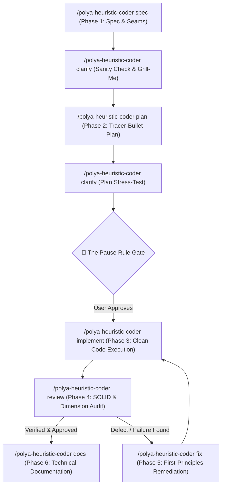

<!-- markdownlint-disable -->

# Polya Heuristic Coder (`polya-coder`)

> **Veteran Principal Engineering Discipline Powered by Pólya's 1945 Heuristics & Uncle Bob's Clean Architecture**

An elite, highly disciplined software engineering kit designed for AI coding agents and human engineers. It merges the legendary mathematical problem-solving heuristics of **George Pólya** (*How to Solve It*, 1945) with the industry-defining **Clean Architecture, Clean Code, and SOLID principles** of **Robert C. "Uncle Bob" Martin**.

---

## 🌟 The Core Philosophy

1. **Understand Before Coding:** *"It is foolish to answer a question that you do not understand. It is sad to work for an end that you do not desire"* (Pólya, 1945). Never write a single line of production code before establishing a rock-solid mental model of the **Unknown**, the **Data**, and the **Condition**.
2. **Clean Architecture Seams:** Decouple systems into clean concentric circles (Entities ➔ Use Cases ➔ Interface Adapters ➔ Frameworks/Drivers). Business policies never depend on infrastructure or external frameworks.
3. **The Pause Rule (Mandatory Gate):** Always pause between planning and implementation. The agent must present the architectural plan and data flow and obtain explicit user confirmation before writing code.
4. **Land and Expand (Tracer Bullets):** Implement the minimal end-to-end vertical slice first (*Land*). Secure the baseline before adding advanced capabilities (*Expand*).
5. **Clean Code & Boy Scout Rule:** Small, focused functions doing one thing only. Self-documenting code with intention-revealing names. Leave every file cleaner than you found it.
6. **First-Principles Debugging:** Cease blind patching. Trace the broken seam across architectural layers and isolate the root cause before touching functional code.

---

## 🎯 Unified Command & Interactive Router

`polya-coder` utilizes a **single unified slash command** for the entire lifecycle:

```text
/polya-heuristic-coder [phase] [instruction] [@context-file]
```

### 1. Mode 1: Interactive Triage (Without Arguments)
When invoked as a bare command without arguments:
```text
/polya-heuristic-coder
```
The agent acts as a **Socratic Mentor** (Senior Principal Engineer), displaying an interactive 5-phase menu, and inquiring which phase to run and what context files are available. When invoked with a prompt, the agent first studies the prompt and its attachments (Unknown, Data, Condition), marks guesses as `[ASSUMPTION]`, then proposes the single best-matching phase with brief reasoning, up to three suggestions, and a binary confirmation; the full menu remains as fallback. No phase executes without explicit user confirmation.

### 2. Mode 2: Direct Phase Execution (With Phase Keyword)
Specify the phase directly along with instructions and file attachments:

| Phase Keyword | SDLC Phase | Description & Heuristic Focus | Upstream Document |
| :--- | :--- | :--- | :--- |
| **`explore`** | Phase 0: Discovery | Problem framing, repository topography critique, architectural trade-offs (*The Inventor's Paradox*), and feasibility spikes. | Brief / Problem idea |
| **`spec`** | Phase 1: Specification | Deconstruct *Unknown, Data, Condition*, *Setting Up Equations*, and map *Clean Architecture Seams*. | Discovery Draft / Notes |
| **`clarify`** | Checkpoint: Clarification | Interrogate ambiguities, `[ASSUMPTION]` tags, *Condition Sanity Check*, Grill-Me protocol (A/B options), and *Readiness Score*. | Target `/spec/` / `/plan/` |
| **`plan`** | Phase 2: Planning | *Working Backwards*, *Auxiliary Problems*, *Land & Expand (Tracer Bullets)*, Plan B, and **The Pause Rule**. | Approved `/spec/` |
| **`implement`** | Phase 3: Execution | Code execution with *Clean Code*, single-responsibility small functions, and *Boy Scout Rule* compliance. | Approved `/plan/` |
| **`review`** | Phase 4: Review | Audit 5 SOLID principles (SRP, OCP, LSP, ISP, DIP), boundary specialization testing, and data type dimensions. | Source code + Spec |
| **`docs`** | Phase 6: Documentation | Author user/developer documentation based on the 4 Diátaxis quadrants (Tutorials, How-To, Reference, Explanation). | Spec / Plan / Source code |
| **`fix`** | Phase 5: Bug Remediation | Cease *blind patching*, return to *First Principles*, trace *broken seam*, and formulate reproduction test. | Error log / Stack trace |
| **`fast-track`** | Bypass: Fast-Track | Routine problems, one-shot surgical fixes, and minor refactors (*Pedantry vs Mastery*). | None / Code snippet |
| **`map`** | Utility: Architecture | Traverse directory structure, map Clean Architecture seams, and generate `docs/ARCHITECTURE.md`. | Repository root |

### 3. Mode 3: Phase Completion & New Session Handoffs
At the conclusion of every phase, the agent executes a structured 4-step wrap-up:
1. Validates output artifact & scores readiness.
2. Offers a memory checkpoint via `/memory-manager`.
3. Strongly advises opening a **new chat session** to prevent context bleeding and token bloat.
4. Generates a **ready-to-copy handoff prompt** for the next phase with attached upstream documents.

---

## 🔄 The Complete SDLC Lifecycle



#### ASCII Flow Representation:

```text
====================================================================================================
               POLYA-CODER COMPLETE PIPELINE: DISCOVERY ➔ SPEC ➔ PLAN ➔ CODE ➔ REVIEW ➔ DOCS
====================================================================================================

[ Phase 1: SPECIFICATION ] (Pólya Phase 1: Understand the Problem)
      │
      ▼
┌───────────────────────────────┐
│ /polya-heuristic-coder spec   │ ──▶ [ /spec/ & docs/adr/ ] ──▶ ( Sanity Check & Equation Mapping )
└───────────────────────────────┘
      │
      ▼
┌───────────────────────────────┐
│ /polya-heuristic-coder clarify│ ──▶ [ docs/audit/ ] ──▶ ( Interrogate Assumptions, Grill-Me A/B, Readiness Score )
└───────────────────────────────┘
      │
      ▼
[ Phase 2: PLANNING ] (Pólya Phase 2: Devising a Plan)
      │
      ▼
┌───────────────────────────────┐
│ /polya-heuristic-coder plan   │ ──▶ [ /plan/ ] ──▶ ( Land & Expand / Tracer Bullets )
└───────────────────────────────┘
      │
      ▼
┌───────────────────────────────┐
│ /polya-heuristic-coder clarify│ ──▶ ( Optional Plan Interrogation & Stress-Test )
└───────────────────────────────┘
      │
      ▼
🛑 MANDATORY GATE: THE PAUSE RULE
(Halt execution! Await explicit user confirmation before writing functional code)
      │
      ▼ [Approved]
[ Phase 3: IMPLEMENTATION ] (Pólya Phase 3: Carrying Out the Plan)
      │
      ▼
┌───────────────────────────────┐
│ /polya-heuristic-coder implement ──▶ ( Clean Code, Respice Finem, Boy Scout Rule, Surgical Edits )
└───────────────────────────────┘
      │
      ▼
[ Phase 4: REVIEW & AUDIT ] (Pólya Phase 4: Looking Back)
      │
      ├───────────────────────────────┐
      │ (If Verified & Approved)      │ (If Defects / Invariant Violations Emerge)
      ▼                               ▼
┌───────────────────────────────┐   ┌───────────────────────────────┐
│ /polya-heuristic-coder docs   │   │ /polya-heuristic-coder fix    │ ──▶ ( First Principles, Trace Broken Seam )
└───────────────────────────────┘   └───────────────────────────────┘
      │ [docs/{tutorials,how-to,reference,explanation}/]
      ▼
[ Phase 6: TECHNICAL DOCUMENTATION ] (Pedagogical Transfer & Diátaxis Framework)
```

---

## 🧰 Pólya's Heuristic Arsenal (Quick Reference)

| Heuristic Tool | Mathematical Origin (1945) | Software Engineering Application |
| :--- | :--- | :--- |
| **Analogy** | Solve a problem analogous to the original one. | Reuse proven architectural patterns or similar modules already existing in the repository. |
| **Specialization** | Test extreme or limiting cases ($0$, $\infty$). | Edge case validation: empty collections, null inputs, network timeouts, single-element arrays. |
| **Generalization** | State the problem in broader, more comprehensive terms. | Refactoring duplicated logic into a generic utility or reusable service. |
| **Test by Dimension** | Verify equations by comparing physical/geometric units. | Strict type/unit validation: timestamps (ms vs s), currencies (cents vs dollars), enum bounds. |
| **Decomposing & Recombining** | Break the figure into parts and examine different combinations. | Decoupling monolithic functions into pure utility helpers, distinct layers, and single-responsibility services. |
| **Working Backwards** | Assume what is sought as already found (Pappus Analysis). | Contract-first design: define the final output DTO/response first, then work backwards to implement it. |
| **Auxiliary Problem** | Introduce an easier problem as a stepping stone. | Spikes, proof-of-concept scripts, mock servers, or minimal reproducible examples. |
| **Setting Up Equations** | Translate ordinary language into mathematical symbols. | Translating unstructured human requirements clause-by-clause into strict DTOs, schemas, and API contracts. |
| **Symmetry** | Treat symmetrically what is naturally symmetrical. | Ensuring dual operations pair cleanly: `subscribe/unsubscribe`, `serialize/deserialize`, `open/close`. |
| **Restating the Problem** | State the problem in an alternative language or view. | Paradigm shift: rewriting tangled business logic as a State Machine (FSM) or Set Operations. |
| **Reductio ad Absurdum** | Derive a contradiction from assuming the contrary. | Negative test suites and invariant checks proving impossible/corrupt states cannot exist. |

---

## 🚨 Signs of Progress vs. Blind Alleys

| Favorable Signs of Progress (Keep Going) | Warning Signs of a Blind Alley (Turn Back Immediately) |
| :--- | :--- |
| • A previously unhandled constraint is cleanly satisfied.<br>• Data elements link cleanly to the unknown without hacks.<br>• A test fails for the *expected, exact* reason.<br>• The error surface area narrows with each step. | • Fixing one bug introduces new, unrelated errors in other files.<br>• The proposed patch requires increasing layers of nested `if-else` hacks.<br>• You must relax or compromise core business invariants to make it compile.<br>• The fix feels unnatural, complex, or fragile. |

---

## 🛠️ Cross-Cutting Utility Skills

- **`memory-manager`:** Manages the persistent project memory file (`memory.instructions.md`). Ensures cross-session context retention, knowledge base updates, and checkpoint compaction.
- **`/polya-heuristic-coder map` (or `sdlc-map-architecture`):** Maps repository topology, directory purposes, and Clean Architecture seams into `docs/ARCHITECTURE.md`.

---

## 📂 Directory Structure

```text
polya-coder/
├── .agents/
│   ├── instructions/
│   │   ├── clean-code-clean-architecture.instructions.md
│   │   ├── markdown.instructions.md
│   │   └── memory.instructions.md
│   ├── rules/
│   │   └── PolyaOrchestrator.md
│   ├── skills/
│   │   ├── memory-manager/
│   │   │   └── SKILL.md
│   │   ├── polya-heuristic-coder/
│   │   │   ├── references/
│   │   │   │   ├── ARCHITECTURE-MAPPING-WORKFLOW.md
│   │   │   │   ├── ARCHITECTURE-TEMPLATE.md
│   │   │   │   ├── BUGFIX-PLAN-TEMPLATE.md
│   │   │   │   ├── CLARIFICATION-REPORT-TEMPLATE.md
│   │   │   │   ├── DISCOVERY-DRAFT-TEMPLATE.md
│   │   │   │   ├── DOCS-TEMPLATE.md
│   │   │   │   ├── PLAN-TEMPLATE.md
│   │   │   │   ├── REVIEW-REPORT-TEMPLATE.md
│   │   │   │   └── SPEC-TEMPLATE.md
│   │   │   └── SKILL.md
│   │   └── polya-init/
│   │       └── SKILL.md
│   └── standards/
│       ├── ADR-FORMAT.md
│       └── CONTEXT-FORMAT.md
├── AGENTS.md
└── README.md
```

---

## 🚀 Quick Start & Example Prompts

### Interactive Menu (Interactive Triage / No Arguments)
```text
/polya-heuristic-coder
```
When invoked with a prompt, the agent studies the prompt, proposes a single phase with suggestions to confirm, and only then shows the menu as fallback. Nothing runs until you confirm.

### Phase 0: Problem Discovery & Exploration
```text
/polya-heuristic-coder explore Survey the problem space for multi-region webhook processing. Critique existing repository topography, identify tech debt, evaluate architectural trade-offs using the Inventor's Paradox, and generate docs/discovery/webhook-discovery.md.
```

### Phase 1: Technical Specification
```text
/polya-heuristic-coder spec Please analyze requirements for the new payment checkout flow. Deconstruct the Unknown, Data, and Condition, map Clean Architecture seams, and generate /spec/checkout-spec.md.
```

### Checkpoint: Clarification & Ambiguity Interrogation
```text
/polya-heuristic-coder clarify @spec/checkout-spec.md Interrogate all [ASSUMPTION] tags, unhandled edge cases, and timeout scenarios. Enforce Grill-Me protocol with concrete A/B choices and calculate Readiness Score.
```

### Phase 2: Implementation Planning
```text
/polya-heuristic-coder plan @spec/checkout-spec.md Create a tracer-bullet implementation plan with Land-and-Expand vertical slices and contingency Plan B. Stop at the Pause Rule.
```

### Phase 3: Implementation
```text
/polya-heuristic-coder implement @plan/checkout-plan.md Execute vertical slice 1. Enforce Uncle Bob's Clean Code, small functions, intention-revealing names, and the Boy Scout Rule.
```

### Phase 4: Code Review & Quality Audit
```text
/polya-heuristic-coder review @spec/checkout-spec.md @plan/checkout-plan.md Audit the checkout implementation against SOLID principles, boundary specialization, and dimensional consistency.
```

### Phase 6: Technical Documentation (Diátaxis)
```text
/polya-heuristic-coder docs @spec/checkout-spec.md Author a How-To guide and Reference documentation for the new checkout flow adhering strictly to the Diátaxis framework.
```

### Phase 5: Bug Remediation (First Principles)
```text
/polya-heuristic-coder fix Here is the failing checkout race condition log. Cease blind patching, return to first principles, trace the broken seam, and isolate the root cause with a reproduction test.
```

### Fast-Track: Routine One-Shot Bypass
```text
/polya-heuristic-coder fast-track Fix typo in authorization header and bump retry count to 3 in config.
```

### Architecture Topography Mapping
```text
/polya-heuristic-coder map Scan repository structure, identify Clean Architecture seams, synthesize topological figure, and generate docs/ARCHITECTURE.md.
```

### Context & Memory Checkpoint
```text
/memory-manager Save progress and key architectural decisions from this session to memory.instructions.md.
```

---

## 🛡️ Security, Trust & Compliance

This kit is designed and verified to satisfy enterprise-grade autonomous agent security benchmarks:
- **Gen Agent Trust Hub:** **PASS** (Zero prompt injection leakage, strict data boundary isolation, zero exfiltration).
- **Socket Security:** **PASS** (Zero external dependencies, no uncontrolled binary or script executions).
- **Snyk Code:** **PASS** (Zero hardcoded secrets, defensive boundaries, strict Floor-Guard anti-cheat enforcement).
