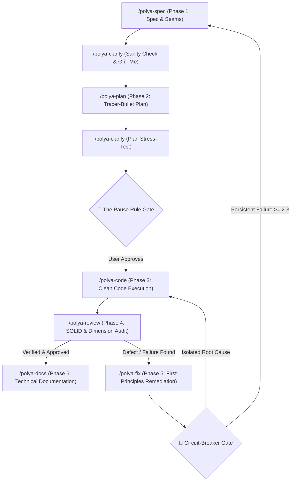

<!-- markdownlint-disable -->

# Polya Heuristic Coder (`polya-coder`)

> **Veteran Principal Engineering Discipline Powered by Pólya's 1945 Heuristics & Uncle Bob's Clean Architecture**

An elite, highly disciplined software engineering kit designed for AI coding agents and human engineers. It merges the legendary mathematical problem-solving heuristics of **George Pólya** (*How to Solve It*, 1945) with the industry-defining **Clean Architecture, Clean Code, and SOLID principles** of **Robert C. "Uncle Bob" Martin**.

---

## 🌟 The Core Philosophy

1. **Understand Before Coding:** *"It is foolish to answer a question that you do not understand. It is sad to work for an end that you do not desire"* (Pólya, 1945). Never write a single line of production code before establishing a rock-solid mental model of the **Unknown**, the **Data**, and the **Condition**.
2. **Clean Architecture Seams:** Decouple systems into clean concentric circles (Entities ➔ Use Cases ➔ Interface Adapters ➔ Frameworks/Drivers). Business policies never depend on infrastructure or external frameworks.
3. **The Pause Rule (Mandatory Gate):** Always pause between planning and implementation. The agent must present the architectural plan and data flow and obtain explicit user confirmation before writing code.
4. **Land and Expand (Tracer Bullets):** Implement the minimal end-to-end vertical slice first (*Land*). Secure the baseline before adding advanced capabilities (*Expand*).
5. **Clean Code & Boy Scout Rule:** Small, focused functions doing one thing only. Self-documenting code with intention-revealing names. Leave every file cleaner than you found it.
6. **First-Principles Debugging & Circuit-Breaker:** Cease blind patching. Trace the broken seam across architectural layers and isolate the root cause before touching functional code. Trigger an immediate hard-stop if 2–3 fix attempts fail.
7. **Architectural Pragmatism (Pedantry vs. Mastery):** Fit architectural ceremony to the problem scale. Enforce strict 4-layer decoupling for enterprise core domains, but avoid over-engineering standalone scripts, migrations, or lightweight utilities with artificial layer overhead.

---

## 🎯 Hub & Spoke Modular Architecture & Slash Commands

`polya-coder` utilizes a **Hub & Spoke modular skill architecture** supporting dedicated phase sub-skills, autonomous intent auto-detection, and interactive triage:

```text
# Dedicated Modular Sub-Skill Commands
/polya-explore [instruction] [@context-file (optional)]
/polya-spec [instruction] [@context-file (optional)]
/polya-clarify [@spec/... or @plan/...]
/polya-plan [@spec/...]
/polya-code [@plan/...]
/polya-review [@spec/... @plan/...]
/polya-fix [error log or repro test]
/polya-docs [@spec/... or @plan/...]
/polya-fast-track [routine task or quick fix]
/polya-map [repository path (optional)]

# Autonomous Router & Natural Intent Triage
/polya-router [full user intent / task description / brief] [@context-file (optional)]
```

### 1. The Autonomous Router (`/polya-router`)
When invoked with a full user intent, task description, or feature brief without knowing which phase to start:
- **Autonomous Codebase Reconnaissance:** If context files are omitted, the agent does not halt or blindly ask for files; it autonomously inspects the workspace, topography, and Clean Architecture seams first.
- **Auto-Routing Decision:** Deconstructs Unknown, Data, and Condition, mapping intent to the optimal modular command (`/polya-explore`, `/polya-spec`, `/polya-plan`, `/polya-code`, `/polya-fix`, `/polya-docs`, `/polya-fast-track`, `/polya-map`).
- **Execution Protocol & The Pólya Triage Card:** For clear intent, renders a **Pólya Triage Card**, announces discovered seams, and executes the phase immediately. For ambiguous intents, proposes the best-matching phase. Always enforces **The Pause Rule**.
- **Bare Invocation (Socratic Quick-Diagnostic):** When invoked as bare `/polya-router` without arguments, renders the standardized interactive triage card:

```text
┌─ 🧭 Pólya Socratic Triage Quick-Diagnostic ───────────────────────────────────
│ • Question 1 (Core Goal)     : What is the primary symptom or outcome desired?
│ • Question 2 (Problem Nature): Is this greenfield, refactoring, or an elusive bug?
│ • Question 3 (Constraints)   : Are there API contracts, tests, or SLAs to satisfy?
├───────────────────────────────────────────────────────────────────────────────
│ 💡 How to Respond:
│   [Option A] Type a modular command (/polya-explore, /polya-spec, /polya-plan, etc.)
│   [Option B] Answer the 3 questions directly in your own natural language
└───────────────────────────────────────────────────────────────────────────────
```

### 2. Dedicated Modular Sub-Skills

| Slash Command | SDLC Phase | Description & Heuristic Focus | Upstream Document |
| :--- | :--- | :--- | :--- |
| **`/polya-explore`** | Phase 0: Discovery | Problem framing, repository topography critique, architectural trade-offs (*The Inventor's Paradox*), and feasibility spikes. | Brief / Problem idea |
| **`/polya-spec`** | Phase 1: Specification | Deconstruct *Unknown, Data, Condition*, *Setting Up Equations*, and map *Clean Architecture Seams*. | Discovery Draft / Notes |
| **`/polya-clarify`** | Checkpoint: Clarification | Interrogate ambiguities, `[ASSUMPTION]` tags, *Condition Sanity Check*, Grill-Me protocol (A/B options), and *Readiness Score*. | Target `/spec/` / `/plan/` |
| **`/polya-plan`** | Phase 2: Planning | *Working Backwards*, *Auxiliary Problems*, *Land & Expand (Tracer Bullets)*, Plan B, and **The Pause Rule**. | Approved `/spec/` |
| **`/polya-code`** | Phase 3: Execution | Code execution with *Clean Code*, single-responsibility small functions, and *Boy Scout Rule* compliance. | Approved `/plan/` |
| **`/polya-review`** | Phase 4: Review | Audit 5 SOLID principles (SRP, OCP, LSP, ISP, DIP), boundary specialization testing, and data type dimensions. | Source code + Spec |
| **`/polya-fix`** | Phase 5: Bug Remediation | Cease *blind patching*, return to *First Principles*, trace *broken seam*, and formulate reproduction test. | Error log / Stack trace |
| **`/polya-docs`** | Phase 6: Documentation | Author user/developer documentation based on the 4 Diátaxis quadrants (Tutorials, How-To, Reference, Explanation). | Spec / Plan / Source code |
| **`/polya-fast-track`**| Bypass: Fast-Track | Routine problems, one-shot surgical fixes, and minor refactors (*Pedantry vs Mastery*). | None / Code snippet |
| **`/polya-map`** | Utility: Architecture | Traverse directory structure, map Clean Architecture seams, and generate `docs/ARCHITECTURE.md`. | Repository root |
| **`/polya-router`** | Router & Triage | Autonomous intent auto-triage and interactive 3-question diagnostic. | User intent / Bare command |

### 3. Mode 3: Phase Completion & New Session Handoffs
At the conclusion of every phase, the agent executes a structured 4-step wrap-up:
1. Validates output artifact & scores readiness.
2. Offers a memory checkpoint via `/memory-manager`.
3. Strongly advises opening a **new chat session** to prevent context bleeding and token bloat.
4. Generates a **ready-to-copy handoff prompt** for the next phase with attached upstream documents.

---

## ⚡ Fast-Track vs. Full SDLC Decision Matrix

To prevent both over-engineering on simple fixes (*Pedantry*) and under-engineering on critical domain boundaries, consult this decision matrix before choosing your execution mode:

| Dimension / Criteria | 🚀 Fast-Track Bypass Mode (`fast-track`) | 🏛️ Full Pólya SDLC Pipeline (`explore` ➔ `spec` ➔ `plan` ➔ `implement`) |
| :--- | :--- | :--- |
| **Problem Nature** | **Routine Problem:** Direct pattern substitution, well-understood fix, zero architectural ambiguity. | **Non-Routine Problem:** Novel feature, complex domain logic, concurrency, state management, or cross-cutting seam. |
| **Task Sizing** | **XS / S** (1 – 2 files impacted). | **M / L** (3 – 8 files organized into vertical tracer bullets). |
| **Architectural Boundary** | Localized logic or UI tweak. Zero new public APIs, DTOs, or database schema migrations. | Introduces new API contracts, entities, use cases, database tables, or third-party adapters. |
| **Documentation Ceremony** | **Zero Paperwork:** Mental micro-understanding and micro-plan; executes in a single fluid motion. | **Full SDLC Artifacts:** Structured `/spec/`, `/plan/`, and `docs/reviews/` required before and after coding. |
| **Mandatory Pushback Rule** | **The Excavator Rule:** Reject multi-module features or architectural changes under `fast-track`. | **The Pause Rule:** Strictly forbid functional code generation until plan is approved by the user. |
| **Example Scenarios** | Typo fix, adding a single validated field to existing form, dependency bump, self-contained CSS fix. | New checkout workflow, OAuth2 authentication provider, payment webhook reconciliation, order state machine. |

> [!TIP]
> **Quick Rule of Thumb:** If you can implement and verify the change within 5 minutes without altering database schema or public contracts, use `fast-track`. Otherwise, let Pólya guide you through Phase 1 (`spec`) and Phase 2 (`plan`).

---

## 🔄 The Complete SDLC Lifecycle



#### ASCII Flow Representation:

```text
====================================================================================================
               POLYA-CODER COMPLETE PIPELINE: DISCOVERY ➔ SPEC ➔ PLAN ➔ CODE ➔ REVIEW ➔ DOCS
====================================================================================================

[ Phase 1: SPECIFICATION ] (Pólya Phase 1: Understand the Problem)
      │
      ▼
┌───────────────────────────────┐
│ /polya-spec                   │ ──▶ [ /spec/ & docs/adr/ ] ──▶ ( Sanity Check & Equation Mapping )
└───────────────────────────────┘
      │
      ▼
┌───────────────────────────────┐
│ /polya-clarify                │ ──▶ [ docs/audit/ ] ──▶ ( Interrogate Assumptions, Grill-Me A/B, Readiness Score )
└───────────────────────────────┘
      │
      ▼
[ Phase 2: PLANNING ] (Pólya Phase 2: Devising a Plan)
      │
      ▼
┌───────────────────────────────┐
│ /polya-plan                   │ ──▶ [ /plan/ ] ──▶ ( Land & Expand / Tracer Bullets )
└───────────────────────────────┘
      │
      ▼
┌───────────────────────────────┐
│ /polya-clarify                │ ──▶ ( Optional Plan Interrogation & Stress-Test )
└───────────────────────────────┘
      │
      ▼
🛑 MANDATORY GATE: THE PAUSE RULE
(Halt execution! Await explicit user confirmation before writing functional code)
      │
      ▼ [Approved]
[ Phase 3: IMPLEMENTATION ] (Pólya Phase 3: Carrying Out the Plan)
      │
      ▼
┌───────────────────────────────┐
│ /polya-code                   │ ──▶ ( Clean Code, Respice Finem, Boy Scout Rule, Surgical Edits )
└───────────────────────────────┘
      │
      ▼
[ Phase 4: REVIEW & AUDIT ] (Pólya Phase 4: Looking Back)
      │
      ├───────────────────────────────┐
      │ (If Verified & Approved)      │ (If Defects / Invariant Violations Emerge)
      ▼                               ▼
┌───────────────────────────────┐   ┌───────────────────────────────┐
│ /polya-docs                   │   │ /polya-fix                    │ ──▶ ( First Principles, Trace Broken Seam )
└───────────────────────────────┘   └───────────────────────────────┘
      │ [docs/{tutorials,how-to,reference,explanation}/]
      ▼
[ Phase 6: TECHNICAL DOCUMENTATION ] (Pedagogical Transfer & Diátaxis Framework)
```

---

## 🧰 Pólya's Heuristic Arsenal (Quick Reference)

| Heuristic Tool | Mathematical Origin (1945) | Software Engineering Application |
| :--- | :--- | :--- |
| **Analogy** | Solve a problem analogous to the original one. | Reuse proven architectural patterns or similar modules already existing in the repository. |
| **Specialization** | Test extreme or limiting cases ($0$, $\infty$). | Edge case validation: empty collections, null inputs, network timeouts, single-element arrays. |
| **Generalization** | State the problem in broader, more comprehensive terms. | Refactoring duplicated logic into a generic utility or reusable service. |
| **Test by Dimension** | Verify equations by comparing physical/geometric units. | Strict type/unit validation: timestamps (ms vs s), currencies (cents vs dollars), enum bounds. |
| **Decomposing & Recombining** | Break the figure into parts and examine different combinations. | Decoupling monolithic functions into pure utility helpers, distinct layers, and single-responsibility services. |
| **Working Backwards** | Assume what is sought as already found (Pappus Analysis). | Contract-first design: define the final output DTO/response first, then work backwards to implement it. |
| **Auxiliary Problem** | Introduce an easier problem as a stepping stone. | Spikes, proof-of-concept scripts, mock servers, or minimal reproducible examples. |
| **Setting Up Equations** | Translate ordinary language into mathematical symbols. | Translating unstructured human requirements clause-by-clause into strict DTOs, schemas, and API contracts. |
| **Symmetry** | Treat symmetrically what is naturally symmetrical. | Ensuring dual operations pair cleanly: `subscribe/unsubscribe`, `serialize/deserialize`, `open/close`. |
| **Restating the Problem** | State the problem in an alternative language or view. | Paradigm shift: rewriting tangled business logic as a State Machine (FSM) or Set Operations. |
| **Reductio ad Absurdum** | Derive a contradiction from assuming the contrary. | Negative test suites and invariant checks proving impossible/corrupt states cannot exist. |

---

## 🚨 Signs of Progress vs. Blind Alleys

| Favorable Signs of Progress (Keep Going) | Warning Signs of a Blind Alley (Turn Back Immediately) |
| :--- | :--- |
| • A previously unhandled constraint is cleanly satisfied.<br>• Data elements link cleanly to the unknown without hacks.<br>• A test fails for the *expected, exact* reason.<br>• The error surface area narrows with each step. | • Fixing one bug introduces new, unrelated errors in other files.<br>• The proposed patch requires increasing layers of nested `if-else` hacks.<br>• You must relax or compromise core business invariants to make it compile.<br>• The fix feels unnatural, complex, or fragile. |

---

## 🛠️ Cross-Cutting Utility Skills & References

- **`memory-manager`:** Manages the persistent project memory file (`memory.instructions.md`). Ensures cross-session context retention, knowledge base updates, and checkpoint compaction.
- **`/polya-map`:** Maps repository topology, directory purposes, and Clean Architecture seams into `docs/ARCHITECTURE.md`.
- **🌟 End-to-End Walkthrough Reference:** [`references/END-TO-END-WALKTHROUGH.md`](.agents/skills/polya-shared/references/END-TO-END-WALKTHROUGH.md) — Comprehensive 6-stage golden reference implementation (Idempotent Webhook Processing Engine with Redis Distributed Lock) demonstrating every template, seam, and rule in action.

---

## 📂 Directory Structure

```text
polya-coder/
├── .agents/
│   ├── instructions/
│   │   ├── clean-code-clean-architecture.instructions.md
│   │   ├── markdown.instructions.md
│   │   └── memory.instructions.md
│   ├── rules/
│   │   └── PolyaOrchestrator.md
│   ├── skills/
│   │   ├── memory-manager/
│   │   │   └── SKILL.md
│   │   ├── polya-clarify/
│   │   │   └── SKILL.md
│   │   ├── polya-code/
│   │   │   └── SKILL.md
│   │   ├── polya-docs/
│   │   │   └── SKILL.md
│   │   ├── polya-explore/
│   │   │   └── SKILL.md
│   │   ├── polya-fast-track/
│   │   │   └── SKILL.md
│   │   ├── polya-fix/
│   │   │   └── SKILL.md
│   │   ├── polya-init/
│   │   │   └── SKILL.md
│   │   ├── polya-map/
│   │   │   └── SKILL.md
│   │   ├── polya-plan/
│   │   │   └── SKILL.md
│   │   ├── polya-review/
│   │   │   └── SKILL.md
│   │   ├── polya-router/
│   │   │   └── SKILL.md
│   │   ├── polya-shared/
│   │   │   └── references/
│   │   │       ├── ARCHITECTURE-MAPPING-WORKFLOW.md
│   │   │       ├── ARCHITECTURE-TEMPLATE.md
│   │   │       ├── BUGFIX-PLAN-TEMPLATE.md
│   │   │       ├── CLARIFICATION-REPORT-TEMPLATE.md
│   │   │       ├── DISCOVERY-DRAFT-TEMPLATE.md
│   │   │       ├── DOCS-TEMPLATE.md
│   │   │       ├── END-TO-END-WALKTHROUGH.md
│   │   │       ├── PLAN-TEMPLATE.md
│   │   │       ├── POLYA-HEURISTIC-ARSENAL.md
│   │   │       ├── REVIEW-REPORT-TEMPLATE.md
│   │   │       └── SPEC-TEMPLATE.md
│   │   └── polya-spec/
│   │       └── SKILL.md
│   └── standards/
│       ├── ADR-FORMAT.md
│       └── CONTEXT-FORMAT.md
├── AGENTS.md
└── README.md
```

---

## 🚀 Quick Start & Example Prompts

### Interactive Menu (Interactive Triage / No Arguments)
```text
/polya-router
```
When invoked as a bare command without arguments, the agent greets you as a Socratic Mentor and presents the triage menu.

### 🌟 Natural Brief & Task Invocations (Option B: Auto-Scanned & Auto-Routed)
You can express your task in natural language without remembering phase names. The agent autonomously recons your codebase, renders a **Pólya Triage Card**, and auto-routes to the optimal phase:

```text
# Feature Design & Architecture (Auto-routed to Phase 1: /polya-spec)
/polya-router we need to design a multi-tenant authentication system using JWT with redis token rotation

# Bug Investigation & Root Cause Analysis (Auto-routed to Phase 5: /polya-fix)
/polya-router race condition occurs when two concurrent checkout requests process the last inventory item

# Greenfield Architecture Exploration (Auto-routed to Phase 0: /polya-explore)
/polya-router explore candidate tech stacks and architectural trade-offs for high-throughput webhook ingestion

# Routine Cleanup & Minor Tweak (Auto-routed to /polya-fast-track)
/polya-router fix typo in auth error message and bump redis connection timeout to 5000ms

# User & Developer Documentation (Auto-routed to Phase 6: /polya-docs)
/polya-router write an end-to-end how-to guide for integrating our payment webhook
```

### Direct Phase Invocations (Option A: Explicit Sub-Skill Slash Commands)

### Phase 0: Problem Discovery & Exploration
```text
/polya-explore Survey the problem space for multi-region webhook processing. Critique existing repository topography, identify tech debt, evaluate architectural trade-offs using the Inventor's Paradox, and generate docs/discovery/webhook-discovery.md.
```

### Phase 1: Technical Specification
```text
/polya-spec Please analyze requirements for the new payment checkout flow. Deconstruct the Unknown, Data, and Condition, map Clean Architecture seams, and generate /spec/checkout-spec.md.
```

### Checkpoint: Clarification & Ambiguity Interrogation
```text
/polya-clarify @spec/checkout-spec.md Interrogate all [ASSUMPTION] tags, unhandled edge cases, and timeout scenarios. Enforce Grill-Me protocol with concrete A/B choices and calculate Readiness Score.
```

### Phase 2: Implementation Planning
```text
/polya-plan @spec/checkout-spec.md Create a tracer-bullet implementation plan with Land-and-Expand vertical slices and contingency Plan B. Stop at the Pause Rule.
```

### Phase 3: Implementation
```text
/polya-code @plan/checkout-plan.md Execute vertical slice 1. Enforce Uncle Bob's Clean Code, small functions, intention-revealing names, and the Boy Scout Rule.
```

### Phase 4: Code Review & Quality Audit
```text
/polya-review @spec/checkout-spec.md @plan/checkout-plan.md Audit the checkout implementation against SOLID principles, boundary specialization, and dimensional consistency.
```

### Phase 5: Bug Remediation (First Principles)
```text
/polya-fix Here is the failing checkout race condition log. Cease blind patching, return to first principles, trace the broken seam, and isolate the root cause with a reproduction test.
```

### Phase 6: Technical Documentation (Diátaxis)
```text
/polya-docs @spec/checkout-spec.md Author a How-To guide and Reference documentation for the new checkout flow adhering strictly to the Diátaxis framework.
```

### Fast-Track: Routine One-Shot Bypass
```text
/polya-fast-track Fix typo in authorization header and bump retry count to 3 in config.
```

### Architecture Topography Mapping
```text
/polya-map Scan repository structure, identify Clean Architecture seams, synthesize topological figure, and generate docs/ARCHITECTURE.md.
```

### Context & Memory Checkpoint
```text
/memory-manager Save progress and key architectural decisions from this session to memory.instructions.md.
```

---

## 🛡️ Security, Trust & Compliance

This kit is designed and verified to satisfy enterprise-grade autonomous agent security benchmarks:
- **Gen Agent Trust Hub:** **PASS** (Zero prompt injection leakage, strict data boundary isolation, zero exfiltration).
- **Socket Security:** **PASS** (Zero external dependencies, no uncontrolled binary or script executions).
- **Snyk Code:** **PASS** (Zero hardcoded secrets, defensive boundaries, strict Floor-Guard anti-cheat enforcement).
