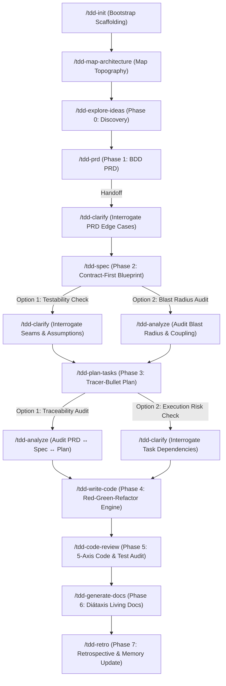

<!-- markdownlint-disable -->

# TDD Spec Skills (`tdd-spec-skills`)

> **Production-Grade Spec-Driven & Test-Driven Development Skills for AI Coding Agents**

An elite, highly disciplined skill package that unifies **Specification-Driven Development (SDD)** and **Test-Driven Development (TDD)**. It combines the rigorous architectural standards of **Awesome Copilot ID SDLC**, the executable specification power of **GitHub Spec Kit**, the constraint-driven quality bars of **Addy Osmani's Agent Skills**, and the domain modeling and vertical slicing of **Matt Pocock's Skills**.

---

## 🌟 The Core Philosophy

1. **Power Inversion (Spec is Executable Truth):** Code is not king; specifications are executable sources of truth that generate, govern, and verify implementations.
2. **No Code Without a Failing Test (Strict TDD):** Functional production code is never written without first writing a failing test (RED) at a pre-agreed public seam.
3. **Domain Ubiquitous Language (`CONTEXT.md`):** Business vocabulary is strictly recorded and harmonized to eliminate jargon ambiguity across all documents and code.
4. **Architectural Memory (`docs/adr/`):** High-impact, hard-to-reverse architectural decisions are captured lazily via the Triple-Gate ADR rule.
5. **Contracted Quality Bar (`CONSTRAINTS.md`):** Performance, coverage, and linting thresholds are explicitly defined and mechanically enforced with a strict *Floor-Guard*.
6. **Tracer-Bullet Vertical Slices:** Plans and tasks are broken down vertically across all architectural layers (DB ➔ Logic ➔ UI) rather than horizontally.
7. **Living Documentation:** User and technical documentation are generated using the Diátaxis Framework, grounded in passing test scenarios as living code examples.

---

## 🔄 The Core SDLC Lifecycle & Quality Gate Routing



#### Text Diagram Representation (Human & AI Accessible):

```text
====================================================================================================
                                  TDD-SPEC SDLC PIPELINE & QUALITY GATES
====================================================================================================

[ Phase 0: DISCOVERY ]
    │
    ▼
┌──────────────────────┐
│  /tdd-explore-ideas  │ ──▶ [ docs/discovery/ ]
└──────────────────────┘
    │
    ▼
[ Phase 1: PRODUCT REQUIREMENTS ]
    │
    ▼
┌──────────────────────┐
│       /tdd-prd       │ ──▶ [ docs/prd/ ] ──▶ ( Handoff ) ──▶ ┌──────────────────────┐
└──────────────────────┘                                       │     /tdd-clarify     │
                                                               │ (Interrogate PRD AC) │
                                                               └──────────────────────┘
                                                                           │
                                                                           ▼
[ Phase 2: SPECIFICATION & CONTRACTS ]
    │
    ▼
┌──────────────────────┐
│      /tdd-spec       │ ──▶ [ /spec/ & docs/adr/ ]
└──────────────────────┘
    │
    ├──▶ [ Option 1 (Recommended) ] ──▶ ┌────────────────────────────────┐
    │                                   │          /tdd-clarify          │
    │                                   │ (Interrogate Seams/Assumptions)│
    │                                   └────────────────────────────────┘
    │                                                   │
    └──▶ [ Option 2 (Blast Radius)] ──▶ ┌────────────────────────────────┐
                                        │          /tdd-analyze          │
                                        │  (Audit Blast Radius & Mocks)  │
                                        └────────────────────────────────┘
                                                        │
                                                        ▼
[ Phase 3: TRACER-BULLET PLANNING ]
    │
    ▼
┌──────────────────────┐
│   /tdd-plan-tasks    │ ──▶ [ /plan/ ]
└──────────────────────┘
    │
    ├──▶ [ Option 1 (Recommended) ] ──▶ ┌────────────────────────────────┐
    │                                   │          /tdd-analyze          │
    │                                   │ (Audit Traceability: PRD↔Spec) │
    │                                   └────────────────────────────────┘
    │                                                   │
    └──▶ [ Option 2 (Risk Check)  ] ──▶ ┌────────────────────────────────┐
                                        │          /tdd-clarify          │
                                        │ (Interrogate Execution Risks)  │
                                        └────────────────────────────────┘
                                                        │
                                                        ▼
[ Phase 4: RED-GREEN-REFACTOR CODING ]
    │
    ▼
┌──────────────────────┐
│   /tdd-write-code    │ ──▶ [ Passing Test Suite & Floor-Guard Enforced ]
└──────────────────────┘
    │
    ▼
[ Phase 5: 5-AXIS CODE & TEST REVIEW ]
    │
    ▼
┌──────────────────────┐
│   /tdd-code-review   │ ──▶ [ docs/review/ ]
└──────────────────────┘
    │
    ▼
[ Phase 6: LIVING DOCUMENTATION ]
    │
    ▼
┌──────────────────────┐
│  /tdd-generate-docs  │ ──▶ [ docs/ (Diátaxis Quad) ]
└──────────────────────┘
    │
    ▼
[ Phase 7: RETROSPECTIVE & MEMORY ]
    │
    ▼
┌──────────────────────┐
│      /tdd-retro      │ ──▶ [ memory.instructions.md & CONSTRAINTS.md ]
└──────────────────────┘
====================================================================================================
```

### 🎯 When to Use `/tdd-clarify` vs `/tdd-analyze`
- **`/tdd-clarify` (The Doubt-Driven Interrogator):** Use after PRD, after Spec, or after Plan to resolve ambiguities, surface missing edge cases, and evaluate the **40/30/30 Readiness Score**.
- **`/tdd-analyze` (The Blast Radius & Traceability Auditor):** Use after Spec to map affected code files and mocking traps, or after Plan to verify 100% testable coverage across PRD, Spec, and Plan before entering the Code phase.

---

## 📋 Skills Directory & Slash Commands

### 1. Primary SDLC Pipeline (Sequential / Core - 10 Skills)

| Stage | Command / Skill | Role / Persona | Core Output & Purpose |
|---|---|---|---|
| **Bootstrap** | `/tdd-init` | **TDD Bootstrapper Architect** | Initializes project governance (`CONSTITUTION.md`, `CONSTRAINTS.md`, `AGENTS.md`) and auto-maps existing codebases. |
| **0. Map** | `/tdd-map-architecture` | **TDD Architecture Mapper** | Audits codebase, testability matrix, CI, and test seams into `docs/ARCHITECTURE.md`. |
| **1. Discover** | `/tdd-explore-ideas` | **TDD Idea Explorer** | 5-Step Idea Assessment (`Intake ➔ Research ➔ Define ➔ Shape ➔ Decide`) with hypothesis metrics. |
| **2. Define** | `/tdd-prd` | **TDD Product Manager** | User stories with executable **Given-When-Then (BDD)** acceptance scenarios. Manages `CONTEXT.md`. |
| **3. Specify** | `/tdd-spec` | **TDD Specification Architect** | Technical blueprint with API contracts, data models, **Pre-Agreed Test Seams**, and ADRs. |
| **4. Plan** | `/tdd-plan-tasks` | **TDD Task Planner** | Breaks spec into **Tracer-Bullet Vertical Slices** with explicit RED-GREEN-VERIFY task steps. |
| **5. Build** | `/tdd-write-code` | **TDD Code Engineer** | Strict Red-Green-Refactor execution engine with *Floor-Guard* anti-cheat enforcement. |
| **6. Verify** | `/tdd-code-review` | **TDD Code & Test Reviewer** | **5-Axis Review** (Spec, Code Health, Security, Perf, Test Efficacy) + Anti-Tautological test audit. |
| **Support** | `/tdd-bug-report` | **TDD Bug Diagnostician** | RCA with the **"Prove-It" Pattern** (must write a failing regression test before fixing code). |
| **7. Document** | `/tdd-generate-docs` | **TDD Technical Writer** | Diátaxis-based user & developer documentation using passing test suites as **Living Examples**. |

---

### 2. Quality & Spec Extensions (Spec Kit Inspired - 3 Skills)

| Command / Skill | Role / Persona | Purpose & TDD Integration |
|---|---|---|
| `/tdd-clarify` | **TDD Requirements Clarifier** | Doubt-Driven interrogation of PRD/Spec to identify missing edge cases and untestable constraints. |
| `/tdd-analyze` | **TDD Codebase Analyst** | Deep pre-execution analysis to map architectural blast radius and detect mocking traps. |
| `/tdd-checklist` | **TDD Checklist Generator** | Translates Specs into an exhaustive Test-Case Inventory matrix (Unit, Integration, E2E). |

---

### 3. Optional Utilities & Tooling (On-Demand Extensions - 7 Skills)

| Command / Skill | Role / Persona | Purpose & TDD Integration |
|---|---|---|
| `/tdd-generate-fixtures` | **TDD Fixture Architect** | Generates type-safe test factories and seeders conforming strictly to `CONTEXT.md` and `/spec/`. |
| `/tdd-configure-ci` | **TDD CI Pipeline Architect** | Configures CI/CD pipelines (GitHub Actions/GitLab CI) to mechanically enforce `CONSTRAINTS.md` floor-guards. |
| `/tdd-mutation-test` | **TDD Mutation Test Auditor** | Runs Mutation Testing (Stryker/Mutmut) to audit whether assertions actually catch code mutations. |
| `/tdd-retro` | **TDD Retrospective Optimizer** | Analyzes test run speed, flakiness, and updates project memory/constraints post-sprint. |
| `/tdd-refactor-legacy` | **TDD Legacy Modernizer** | Pins untested legacy code with Golden Master characterization tests before safe TDD refactoring. |
| `/tdd-pair-coach` | **TDD Pair Programming Coach** | Interactive mentor guiding human developers step-by-step through the TDD Red-Green-Refactor cycle. |
| `memory-manager` | **Context Persistence Engine** | Persists session checkpoints and maintains the permanent Knowledge Base in `memory.instructions.md`. |

---

## 🚀 Getting Started

### 1. Establish Project Foundations
Run once per project or feature branch:
1. Run `/tdd-init` to automatically generate `CONSTITUTION.md` and `CONSTRAINTS.md` tailored to your repository, or use [`CONSTITUTION-TEMPLATE.md`](.agents/standards/CONSTITUTION-TEMPLATE.md) and [`CONSTRAINTS-TEMPLATE.md`](.agents/standards/CONSTRAINTS-TEMPLATE.md).
2. For legacy codebases, `/tdd-init` will automatically map the existing architecture into `docs/ARCHITECTURE.md`.

### 2. Standard Standards Compliance
All agents operating within this package strictly discover and enforce:
- **Domain Glossary (`CONTEXT.md` / `CONTEXT-MAP.md`):** Formatted per `.agents/standards/CONTEXT-FORMAT.md`.
- **Architecture Decision Records (`docs/adr/`):** Formatted per `.agents/standards/ADR-FORMAT.md`.
- **Quality Gates & Readiness Scores:** Weighted scoring (Completeness 40%, Clarity 30%, Alignment 30%) with a strict threshold of 80/100 to proceed.

---

## 🛡️ Anti-Cheat & Quality Directives

- **The "Prove-It" Rule:** No bug claim is accepted without an automated test reproducing it in the RED state.
- **The "Floor-Guard" Rule:** Suppressions like `@ts-ignore`, `eslint-disable`, skipped assertions, or deleted tests trigger immediate pushback.
- **Traceability Mandate:** Every line of code traces to a Task, each Task traces to a Spec seam, and each Spec traces to PRD acceptance scenarios.
